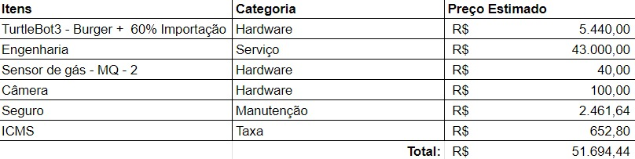

<table>
<tr>
<td>

</td>
<td>
</td>
</tr>
</table>

# Entendimento de negócios

## Matriz de oceano azul

## Matriz de risco

## Canvas de proposta de valor

## Análise financeira

A análise financeira objetivou principalmente estimar o valor que seria gasto pela Gerdau, caso ela optasse por desenvolver uma outra empresa para desenvolver um MVP. Os itens foram estimados com base em análise de mercado.
Principais observações:

- Para o Seguro foi considerado o valor de 10% da somatória dos outros custos;
- Engenharia estima-se que seria 4 semanas de uma equipe de 3 engenheiros de dados pleno(R$ 10000.00) e um sênior(R$ 13000.00);
- O ICMS se baseia na taxa de veículos automotores do estado de São Paulo, que é 12%;
  Em quesito de retorno para Gerdau, seriam todos indiretos, uma vez que a solução pode oferecer maior segurança aos empregados da Gerdau, que por sua vez reduz a quantidade de acidentes. Além disso, otimiza o tempo de manutenção em cada vistoria, o que permite aumentar a produtividade.

  

# Entendimento de metadesign

## Fatores mercadológicos

### Orientação ao mercado e precificação

### Cenário do mercado

### Visão do projeto proposto

## Sistema produto-design

## Sustentabilidade ambiental

Nosso produto consiste essencialmente no desenvolvimento de um software, o que por si só não gera impacto ambiental direto. No entanto, parte da nossa solução envolve o uso do robô TurtleBot, que pode gerar alguns riscos.
O TurtleBot é composto por placas de plástico e alguns itens eletrônicos. Dentre eles há alguns que não seguem princípios sustentáveis. Principal são as baterias de LiPo, isto é, polímeros de Lítio. O problema com essa bateria é que ela é extremamente inflamável, consequentemente para o seu descarte é necessário tomar algumas medidas de segurança que evitem uma possível combustão. Em geral, é preciso desenergizar toda a bateria, de modo lento e por bastante tempo, para que não haja a possibilidade de gerar qualquer voltagem. Após isso, corta-se os fios e então pode ser descartada.
Outro possível problema encontrado pode ser no descarte das placas eletrônicas, uma vez que é necessário direcioná-las para um específico tipo de reciclagem, e as de plástico, já que é um material não biodegradável e compõe maior parte do hardware.
Em geral, a solução pode ter possíveis impactos ambientais contornados, por meio de precauções tomadas preventivamente e medidas de segurança.

# Arquitetura do sistema

## Requisitos funcionais e não funcionais

### Funcionais

### Não funcionais

## Viabilidade técnica

## Proposta geral

Nosso projeto consiste em um sistema integrado que envolve um TurtleBot, um backend e um frontend para permitir a comunicação e controle do TurtleBot por meio de uma interface web. O TurtleBot é um robô de duas rodas equipado com diversos sensores e componentes que auxiliam na realização de suas tarefas.

### Componentes do TurtleBot

O TurtleBot possui os seguintes componentes:

- Microcontrolador OpenCR: usado para ler informações do sensor de gás MQ2.
- Sensor de gás MQ2: detecta gases e envia informações para o OpenCR.
- Raspberry Pi 3: processa informações de todos os componentes e se comunica com o backend.
- Webcam: fornece imagens ao vivo para o Raspberry Pi 3.
- Sensor Lidar 360º: fornece imagens do escaneamento para o Raspberry Pi 3.

### Backend

O backend é construído usando as seguintes tecnologias:

- Docker: permite criar e gerenciar contêineres para facilitar a implantação e escalabilidade.
- Python (Flask): framework web usado para criar a API e gerenciar a lógica do servidor.
- Banco de dados SQL: armazena informações e dados relevantes para o projeto.

O backend é hospedado em um serviço cloud e utiliza a rede ROS2 para comunicação bidirecional com o TurtleBot.

### Frontend

O frontend é desenvolvido com Next.js e React.js, e é hospedado em um serviço cloud. A interface permite que os usuários interajam com o TurtleBot e solicitem ações específicas. O frontend se comunica com o backend, que por sua vez, gerencia a comunicação com o TurtleBot por meio da rede ROS2.

### Comunicação

A comunicação entre os componentes é feita através da rede ROS2. O Raspberry Pi 3 envia informações do TurtleBot para o backend, e o backend pode enviar comandos para o TurtleBot. O frontend se comunica diretamente com o backend para solicitar ações e receber atualizações sobre o estado do TurtleBot.

Aqui está dois diagramas ilustram a arquitetura e as conexões do projeto:  

# Referências
