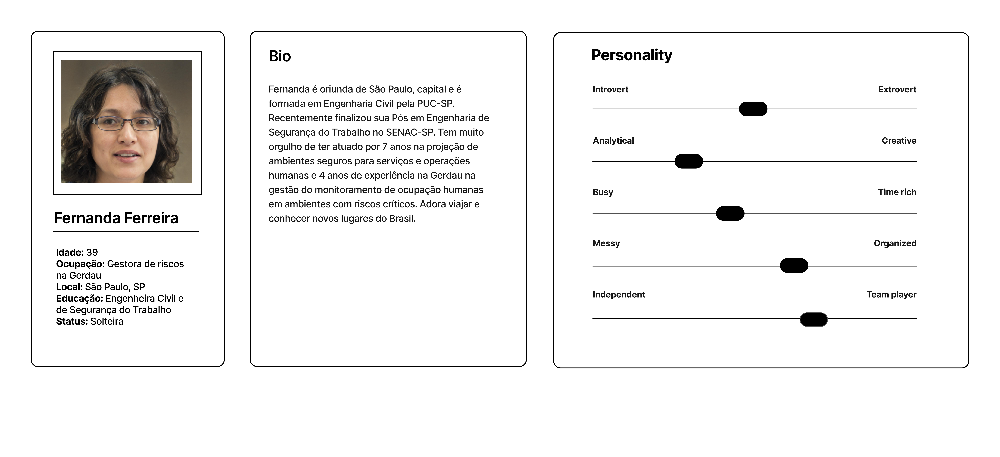
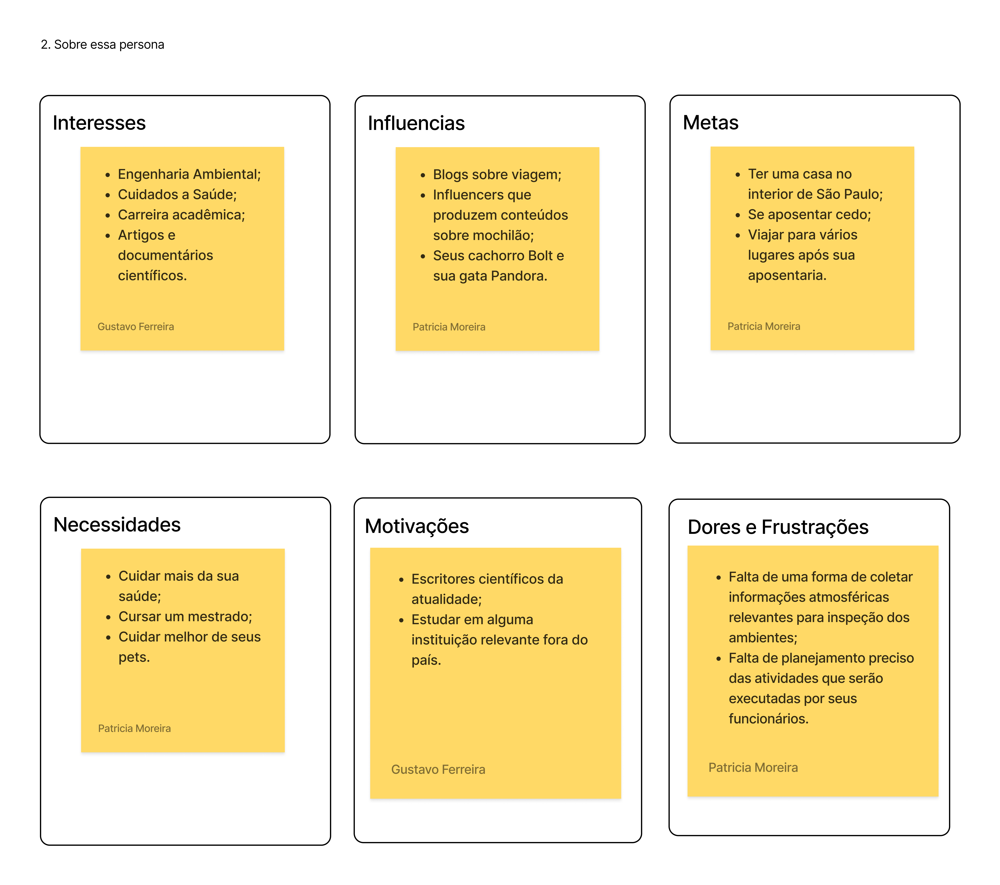
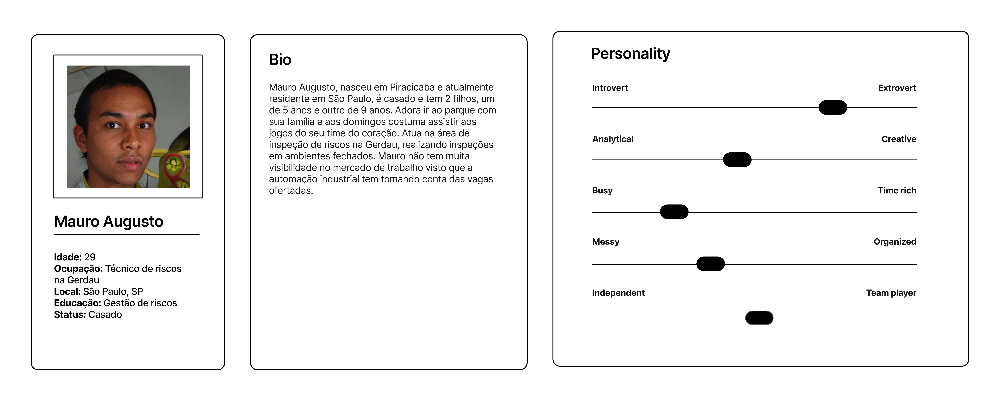
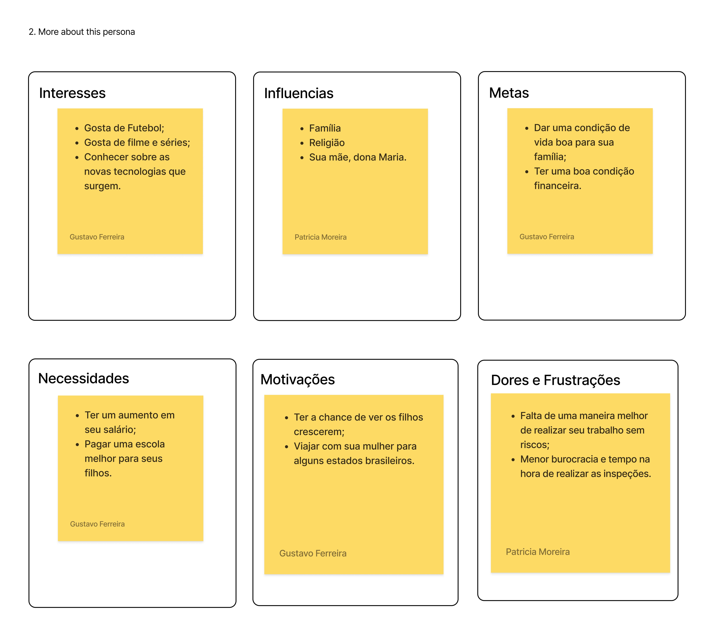

<table><tbody><tr><td><a href="https://www2.gerdau.com.br/"><strong></strong></a></td><td><a href="https://www.inteli.edu.br/"><strong></strong></a></td></tr></tbody></table>

# Entendimento de negócios

## Matriz de oceano azul

É um termo utilizado na estratégia de negócios para descrever um espaço de mercado não explorado ou inexistente.  Em outras palavras, uma matriz de oceano azul representa um mercado novo e desconhecido, onde a concorrência é irrelevante ou inexistente. 

### Tabela

<table><tbody><tr><td><strong>Atributos</strong></td><td><strong>TurtleBee</strong></td><td><a href="https://csrrobotics.com/"><strong><u>CSR Robotics</u></strong></a></td><td><a href="https://nexxis.com/robotic-inspection-inside-confined-spaces/"><strong><u>Nexxis</u></strong></a></td><td><strong>Gerdau</strong></td></tr><tr><td><strong>Preço</strong></td><td>6</td><td>1</td><td>3</td><td>4</td></tr><tr><td><strong>Qualidade</strong></td><td>7</td><td>10</td><td>9</td><td>6</td></tr><tr><td><strong>Tecnologia</strong></td><td>6</td><td>9</td><td>7</td><td>4</td></tr><tr><td><strong>Conforto</strong></td><td>7</td><td>5</td><td>10</td><td>4</td></tr><tr><td><strong>Comodidade</strong></td><td>9</td><td>4</td><td>9</td><td>7</td></tr><tr><td><strong>Praticidade</strong></td><td>10</td><td>5</td><td>8</td><td>7</td></tr></tbody></table>

### Gráfico

- Reduzir
  - Perigo para os técnicos
  - Manutenções de emergência
- Eliminar
  - Acidentes causados aos operadores
  - Erro humano causado nas medidas
- Criar
  - Monitoramento remoto
  - Possibilidade de visualização de imagens dos locais
- Aumentar
  - Segurança
  - Praticidade para os técnicos
  - Agilidade do processo

## Matriz de riscos

## Canvas de proposta de valor

## Análise financeira

A análise financeira objetivou principalmente estimar o valor que seria gasto pela Gerdau, caso ela optasse por desenvolver uma outra empresa para desenvolver um MVP. Os itens foram estimados com base em análise de mercado.  
Principais observações:

Para o Seguro foi considerado o valor de 10% da somatória dos outros custos;

Engenharia estima-se que seria 4 semanas de uma equipe de 3 engenheiros de dados pleno(R$ 10000.00) e um sênior(R$ 13000.00);

O ICMS se baseia na taxa de veículos automotores do estado de São Paulo, que é 12%;  
Em quesito de retorno para Gerdau, seriam todos indiretos, uma vez que a solução pode oferecer maior segurança aos empregados da Gerdau, que por sua vez reduz a quantidade de acidentes. Além disso, otimiza o tempo de manutenção em cada vistoria, o que permite aumentar a produtividade.

[Link da planilha](https://docs.google.com/spreadsheets/d/1r8g5DCsZJI9akuSPPXa-gyhqJ1ZzOMrjQ_6VsDGgP98/edit?usp=sharing)

# Entendimento de metadesign

## Personas

As utilização de personas se dá pela representação fictícia do cliente ideal de um negócio. É baseada em dados reais sobre comportamento e características demográficas dos clientes, assim como histórias pessoais, motivações, objetivos, desafios e preocupações. Nos dando uma visão geral do cliente, e nos ajudando a entender melhor o cliente e suas necessidades e seus problemas enfretados, assim como suas expectativas em relação ao produto. É valido resaltar que foram utilizado informações forneceidas pela Gerdau, e que as personas foram criadas com base nesses dados.

## Fatores mercadológicos

### Orientação ao mercado e precificação

### Cenário do mercado

### Visão do projeto proposto

## Sistema produto-design

## Sustentabilidade ambiental

O produto consiste essencialmente no desenvolvimento de um software, que não gera impacto ambiental direto. No entanto, parte da nossa solução envolve o uso do robô TurtleBot, que pode gerar alguns riscos.

O TurtleBot é composto por placas de plástico e alguns itens eletrônicos. Dentre eles há alguns que não seguem princípios sustentáveis. Principal são as baterias de LiPo, isto é, polímeros de Lítio. O problema com essa bateria é que ela é extremamente inflamável, consequentemente para o seu descarte é necessário tomar algumas medidas de segurança que evitem uma possível combustão. Em geral, é preciso desenergizar toda a bateria, de modo lento e por bastante tempo, para que não haja a possibilidade de gerar qualquer voltagem. Após isso, corta-se os fios e então pode ser descartada.

Nesse contexto, pode-se ser realizada a implementação de planejamentos de monitoramento com o uso das baterias, como o processo de medição de temperatura e tensão, e o aprimoramento do algoritmo do robô, visando garantir o prolongamento da vida útil desses componentes. Procedimentos que visem descartar esses materiais em locais adequados também auxiliam em um plano estratégico. Ademais, é possível avaliar-se o uso de bateria sustentáveis, como baterias de lítio-ferro, que não contaminam o meio ambiente por não possuírem metais raros em sua composição.

Em relação aos demais materiais do robô, o possível problema encontrado pode ser no descarte das placas eletrônicas, uma vez que é necessário direcioná-las para um específico tipo de reciclagem, e as de plástico, já que é um material não biodegradável e compõe maior parte do hardware. Considerando que esse aspecto se configura como um grande desafio do projeto, uma alternativa seria o uso de placas com materiais biodegradáveis, materiais feitos de recursos biodegradáveis que não poluem o meio ambiente se encontram à disposição no mercado.

Em geral, a solução apresenta possíveis impactos ambientais que são contornáveis por meio da implementação de um conjunto de planejamentos que promovam a sustentabilidade do projeto reduzindo os impactos ambientais que referem-se ao sistema robótico.

# Arquitetura do sistema

## Requisitos funcionais e não funcionais

### Funcionais

### Não funcionais

## Viabilidade técnica

O TurtleBee é um projeto focado em gerar uma solução para os problemas presentes no dia a dia dos técnicos envolvidos com espaços confinados, seja tanto na parte de segurança quanto de inspeção, buscando facilitar seu dia a dia através de seu sistema.  
Diante da sua proposta, escolhemos utilizar o TurtleBot Burger, um robô que possui potencial de processamento para os sistemas que vamos utilizar, porém possui certas limitações em relação à sua locomoção. O robô tem dificuldades de se movimentar em locais desnivelados, impossibilitando sua utilização em certas situações, em compensação, o robô é compacto o suficiente para entrar nos locais confinados.  
Além disso, o robô terá sensores acoplados que são responsáveis por identificar níveis de gases tóxicos no ambiente, suas capacidades serão testadas através de sensores mais simples, semelhantes aos usados na indústria. Apesar de serem mais básicos, eles conseguem captar o que é preciso, em contrapartida, não é possível captar todos os gases tóxicos, sendo limitados a apenas 5 gases. Dizendo um pouco sobre onde esses dados serão armazenados, o robô terá um sistema que realizará comunicações através do protocolo MQTT, utilizando o servidor do HiveMQ, que funciona como um broker remoto, por ele possuir dependências da rede, caso a rede caia, será armazenado informações no próprio robô até a conexão ser restabelecida.  
Diante do exposto, pode-se dizer que o TurtleBee é uma solução viável para análise de espaços confinados que facilita o serviço de técnicos dessa área e que promove sua segurança através das informações transmitidas pelo mesmo.

## Proposta geral

Nosso projeto consiste em um sistema integrado que envolve um TurtleBot, um backend e um frontend para permitir a comunicação e controle do TurtleBot por meio de uma interface web. O TurtleBot é um robô de duas rodas equipado com diversos sensores e componentes cruciais para a realização de suas tarefas.

### Componentes do TurtleBot

O TurtleBot será equipado com os seguintes componentes:

- Microcontrolador OpenCR: responsável por ler as informações do sensor de gás MQ2.
- Sensor de gás MQ2: responsável por detectar os gases.
- Raspberry Pi 3: responsável por processar as informações de todos os componentes e se comunica com o backend.
- Webcam: responsável por fornecer imagens ao vivo para o Raspberry Pi 3.
- Sensor Lidar 360º: responsável por fornecer as imagens do escaneamento para o Raspberry Pi 3.

### Backend

O backend será construído usando as seguintes tecnologias:

- Docker: permitirá criar e gerenciar contêineres que facilitará o deploy em um serviço cloud.
- Python (Flask): framework web usado para criar a API e gerenciar a lógica do servidor responsável por estabelecer a comunicação entre o usuário e as atividade do TurtelBot.
- Banco de dados SQL: armazena informações e dados relevantes para o projeto.

O backend será hospedado em um serviço cloud e utiliza a rede ROS2 para comunicação bidirecional com o TurtleBot.

### Frontend

O frontend será desenvolvido com Next.js e React.js, e será hospedado em um serviço cloud. A interface permitirá que os usuários interajam com o TurtleBot e solicitem ações específicas. O frontend se comunicará com o backend, que por sua vez, gerencia a comunicação com o TurtleBot por meio de uma rede ROS2.

### Comunicação

A comunicação entre os componentes é feita através da rede ROS2. O Raspberry Pi 3 envia informações do TurtleBot para o backend, e o backend pode enviar comandos para o TurtleBot. O frontend se comunica diretamente com o backend para solicitar ações e receber atualizações sobre o estado do TurtleBot.

Aqui está dois diagramas ilustram a arquitetura e as conexões do projeto:

  

# Referências
