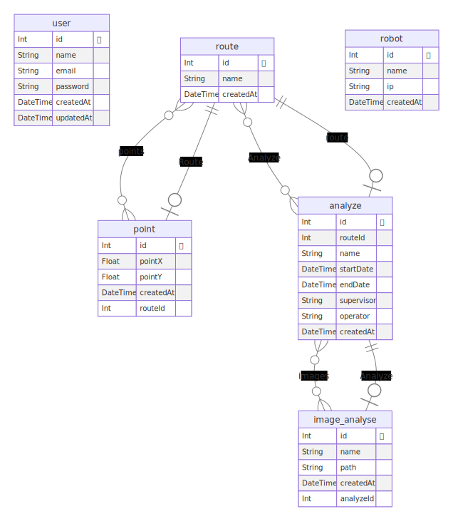
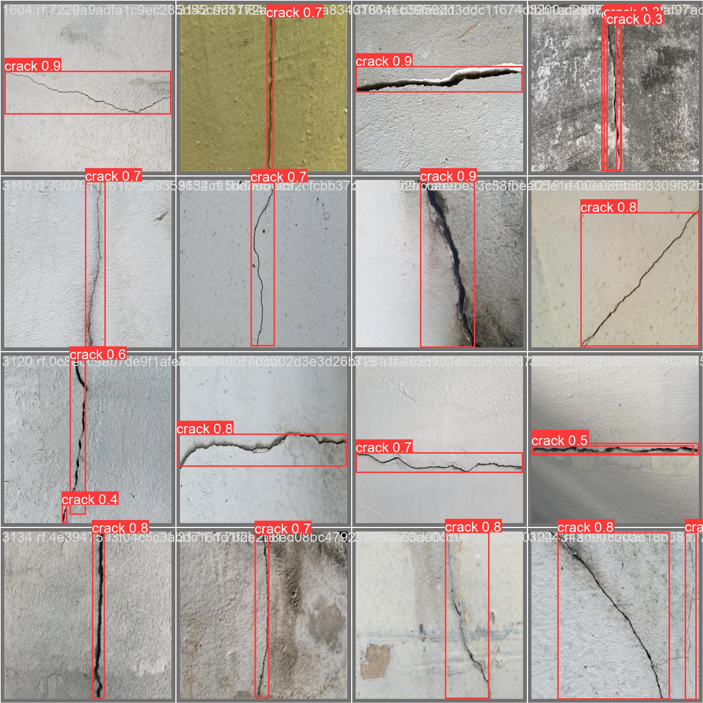
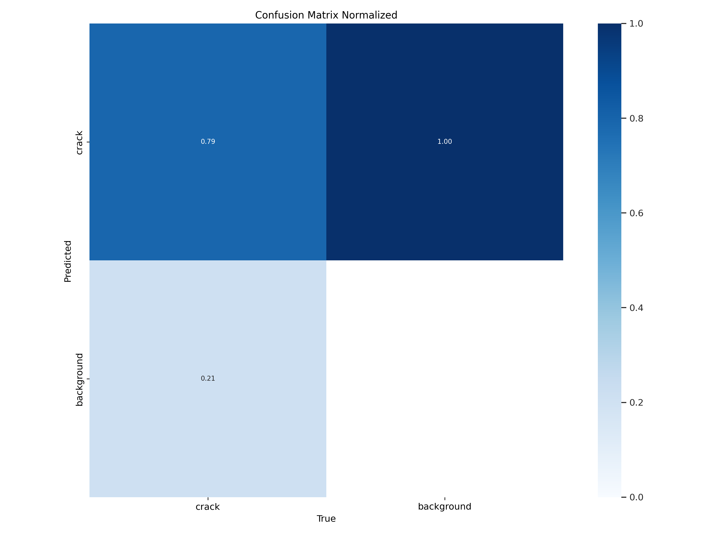
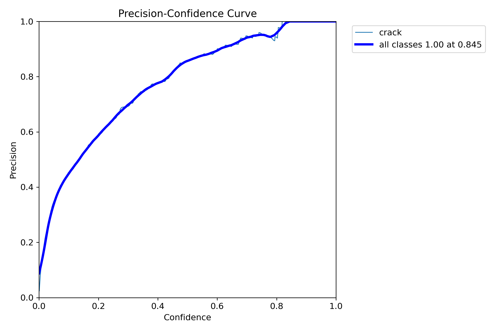
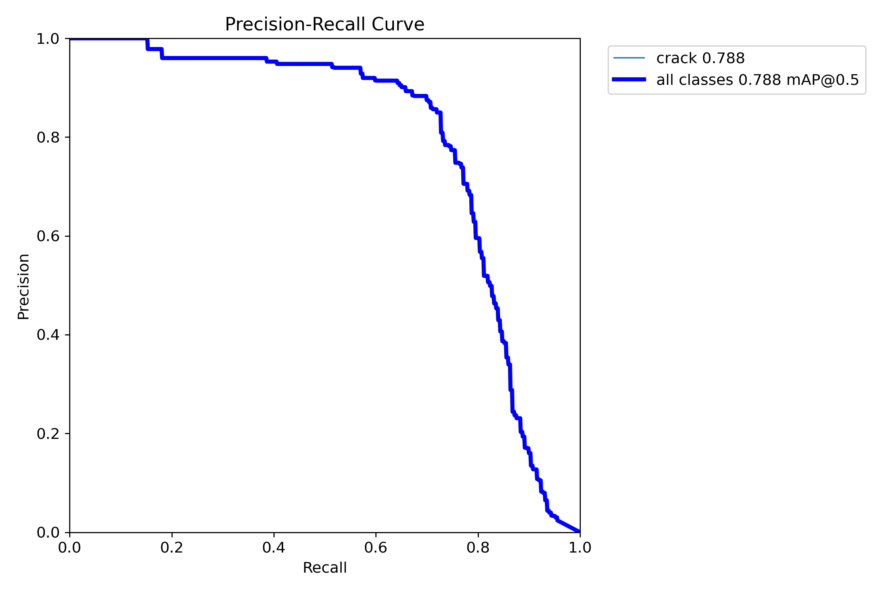
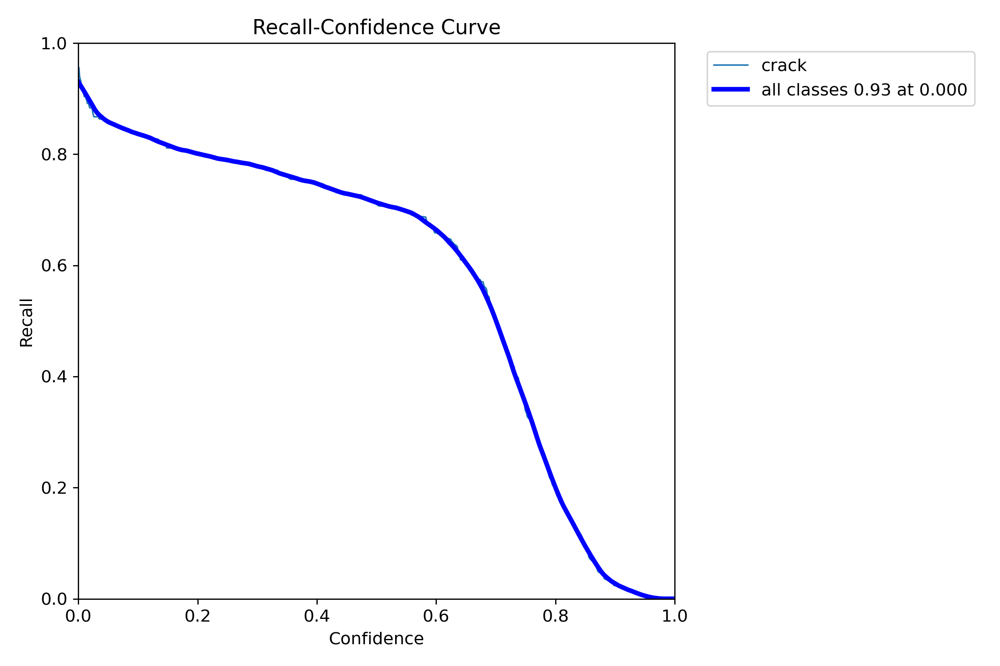
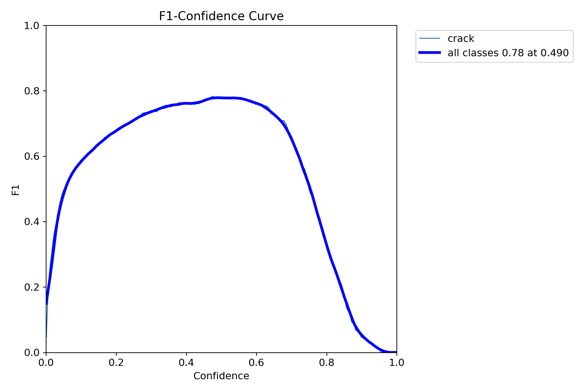

**Conteúdo**

- [Arquitetura do sistema](#arquitetura-do-sistema)
  - [Análise de Requisitos](#análise-de-requisitos)
    - [Requisitos funcionais](#requisitos-funcionais)
    - [Requisitos Não Funcionais](#requisitos-não-funcionais)
    - [Requisitos Não Funcionais Tecnologicos](#requisitos-não-funcionais-tecnologicos)
  - [Viabilidade técnica](#viabilidade-técnica)
  - [Proposta geral](#proposta-geral)
    - [Componentes do TurtleBot](#componentes-do-turtlebot)
    - [Banco de dados](#banco-de-dados)
      - [Diagrama do banco de dados](#diagrama-do-banco-de-dados)
    - [Backend](#backend)
      - [Documentação da API](#documentação-da-api)
      - [Sistema de locomoção e otimização de rota](#sistema-de-locomoção-e-otimização-de-rota)
        - [Arquitetura do sistema de simulação e integração com o sistema operacional robótico](#arquitetura-do-sistema-de-simulação-e-integração-com-o-sistema-operacional-robótico)
        - [Escolha e implementação do algoritmo de otimização de rota](#escolha-e-implementação-do-algoritmo-de-otimização-de-rota)
        - [Integração e validação do sistema de otimização de rota com a movimentação da plataforma robótica](#integração-e-validação-do-sistema-de-otimização-de-rota-com-a-movimentação-da-plataforma-robótica)
    - [Frontend](#frontend)
    - [Comunicação](#comunicação)
      - [Diagrama de arquitetura](#diagrama-de-arquitetura)
      - [Diagrama de blocos](#diagrama-de-blocos)
  - [Ideação e implementação da interface de usuário](#ideação-e-implementação-da-interface-de-usuário)
    - [Mockup](#mockup)
    - [Protótipo navegável](#protótipo-navegável)
    - [Definição das entradas e saídas](#definição-das-entradas-e-saídas)
      - [Interações](#interações)
    - [Implementação da interface de usuário](#implementação-da-interface-de-usuário)
- [Entendimento de negócios](#entendimento-de-negócios)
  - [Análise financeira](#análise-financeira)
  - [Canvas de proposta de valor](#canvas-de-proposta-de-valor)
  - [Matriz de oceano azul](#matriz-de-oceano-azul)
    - [Tabela](#tabela)
    - [Gráfico](#gráfico)
  - [Matriz de riscos](#matriz-de-riscos)
  - [Proposta de Mitigação de Risco](#proposta-de-mitigação-de-risco)
- [Entendimento de metadesign](#entendimento-de-metadesign)
  - [Fatores mercadológicos](#fatores-mercadológicos)
    - [Orientação ao mercado e precificação](#orientação-ao-mercado-e-precificação)
    - [Cenário do mercado](#cenário-do-mercado)
    - [Visão do projeto proposto](#visão-do-projeto-proposto)
    - [Proposta de Inovação](#proposta-de-inovação)
  - [Personas](#personas)
  - [User Stories](#user-stories)
  - [Sistema produto-design](#sistema-produto-design)
    - [Entendimento do problema](#entendimento-do-problema)
    - [Missão do projeto](#missão-do-projeto)
    - [Formas de divulgação](#formas-de-divulgação)
  - [Possibilidades de reuso da solução](#possibilidades-de-reuso-da-solução)
  - [Sustentabilidade ambiental](#sustentabilidade-ambiental)
- [Sistemas de segurança e visão computacional](#sistemas-de-segurança-e-visão-computacional)
  - [**Sistema de visão computacional - Análise de Rachadura nas Paredes**](#sistema-de-visão-computacional---análise-de-rachadura-nas-paredes)
    - [Implementação](#implementação)
    - [Testes e Resultados](#testes-e-resultados)
  - [Sistemas de segurança](#sistemas-de-segurança)
    - [Fabricação e implementação dos dispositivos de segurança](#fabricação-e-implementação-dos-dispositivos-de-segurança)
    - [Sistema de proteção contra comandos indesejados](#sistema-de-proteção-contra-comandos-indesejados)
    - [Mapeamento de riscos dos sistemas eletromecânicos, mecânicos e eletrônicos.](#mapeamento-de-riscos-dos-sistemas-eletromecânicos-mecânicos-e-eletrônicos)
- [Referências](#referências)

# Arquitetura do sistema

## Análise de Requisitos

### Requisitos funcionais

Os Requisitos Funcionais foram inicialmente pensados com base em entrevista com o cliente Luis Gustavo e Rose. Suas colocações foram norteadoras especialmente para os requisitos funcionais pertinentes para as funcionalidades que tanto da aplicação web, quanto o Turtle Bee (modelo AGV) devem realizar respectivamente.

Os demais Requisitos Funcionais - relacionados à estruturação do projeto foram idealizados em discussão entre os participantes do grupo, após análise do documento disponibilizado pelo orientador, denominado TAPI e o onboarding e apresentação do orientador sobre a problemática.

Em suma, a elaboração dos Requisitos Funcionais presentes abaixo deu-se a partir de discussão entre o grupo em encontros de desenvolvimento do projeto presenciais, baseando-se em nosso conhecimento acumulado na modelagem de sistemas e experiências de usuário.

<table><tbody><tr><td><strong>Código</strong></td><td><strong>Requisito Funcional do Modelo AGV</strong></td></tr><tr><td>RF-AGV-01</td><td>O modelo AGV deve possuir um sensor capaz de detectar e quantificar a presença de gases voláteis no ambiente em que foi inserido. Os principais gases a serem detectados são o oxigênio, os gases tóxicos e outros.</td></tr><tr><td>RF-AGV-02</td><td>O modelo AGV deve possuir uma câmera embutida a fim de realizar o registro e a transmissão de imagens para inspeção visual do ambiente, posteriormente, por um funcionário ou pelo próprio sistema.</td></tr><tr><td>RF-AGV-03</td><td>O modelo AGV deve possuir iluminação embutida para garantir maior visibilidade durante a captura de imagens nos ambientes confinados nos quais foi inserido.</td></tr><tr><td>RF-AGV-04</td><td>O modelo AGV deve conseguir navegar pelos ambientes confinados de forma guiada, sendo possível configurar previamente uma rota a ser seguida, com base nos seguintes dados: distância (metros), tempo de deslocamento e pontos de inspeção.</td></tr><tr><td>RF-AGV-05</td><td>O modelo AGV deve possuir um sensor capaz de detectar obstáculos ou objeto em sua frente, evitando possíveis colisões que venham causar algum tipo de dano estrutural ou de funcionamento.</td></tr><tr><td>RF-AGV-06</td><td>O modelo AGV deve fazer medições atmosférica dos gases pelo menos três vezes durante uma análise, sendo elas: no início da análise, no meio da análise e no final da análise.</td></tr><tr><td>RF-AGV-07</td><td>O modelo AGV deve conseguir examinar as condições do oxigênio na atmosfera do ambiente confinado ao qual foi inserido. Diagnosticando se há a existência de deficiência (< 19.5%) ou enriquecimento de oxigênio (> 23%).</td></tr><tr><td>RF-AGV-08</td><td>O modelo AGV deve emitir sinais sonoros para possibilitar a sinalização direta com os funcionários que o utilizam.</td></tr><tr><td>RF-AGV-09</td><td>O modelo AGV deverá ser capaz de voltar sozinho para o ponto de partida em caso de algum tipo de falha em seu funcionamento ou de encontrar um obstáculo que bloqueie o caminho.</td></tr></tbody></table>

<table><tbody><tr><td><strong>Código</strong></td><td><strong>Requisito Funcional do Sistema</strong></td></tr><tr><td>RF-SI-01</td><td>O sistema deve ser capaz de se conectar com o modelo AGV para iniciar uma inspeção, sinalizando erros ou sucesso na tentativa de conexão. Deve exibir a mensagem "Conexão realizada com sucesso" em caso de sucesso e "Conexão mal sucedida" em caso de erro.</td></tr><tr><td>RF-SI-02</td><td>O sistema deve possuir um formulário de cadastro da análise a ser realizada, coletando as seguintes informações: nome, código e distância a ser percorrida pelo modelo AGV, e armazenando-as.</td></tr><tr><td>RF-SI-03</td><td>O sistema deve ser capaz de emitir um relatório final após a inspeção, demonstrando informações como a quantidade de medições das condições realizadas e detalhando em cada ponto a quantidade de oxigênio, a quantidade de gases e a distância percorrida.</td></tr><tr><td>RF-SI-04</td><td>O sistema deve ser capaz de realizar os testes dos sensores e dos atuadores do modelo AGV, informando o status de funcionamento de cada um.</td></tr><tr><td>RF-SI-05</td><td>O sistema deve possuir uma página para exibir a imagem transmitida em tempo real pelo modelo AGV, permitindo que o funcionário acompanhe a inspeção em tempo real.</td></tr><tr><td>RF-SI-06</td><td>O sistema deve permitir que os funcionários gerenciem as análises cadastradas, como a atualização, listagem, exclusão e visualização das análises.</td></tr><tr><td>RF-SI-07</td><td>O sistema deve ser capaz de realizar a comparação das imagens coletadas e dos gases detectados durante a primeira e segunda análises realizadas no ambiente confinado.</td></tr><tr><td>RF-SI-08</td><td>O sistema deve permitir a visualização dos resultados do escaneamento realizado durante a inspeção do LIDAR, sendo exibidos posteriormente em uma página no formato de Modelo Digital de Terreno (MDT) ou Modelo Digital de Superfície (MDS).</td></tr></tbody></table>

### Requisitos Não Funcionais

Os Requisitos Não Funcionais foram idealizados em discussão entre os participantes do grupo, após análise do documento disponibilizado pelo orientador, denominado TAPI e o onboarding e apresentação do orientador sobre a problemática.

<table><tbody><tr><td><strong>Código</strong></td><td><strong>Requisitos Não Funcional</strong></td></tr><tr><td>RNF-01</td><td>O modelo AGV deve possuir um sistema de bateria que não cause faíscas elétricas durante a inspeção realizada pelo robô em ambientes confinados onde possam existir gases inflamáveis.</td></tr><tr><td>RNF-02</td><td>O sistema deve seguir e respeitar o formato pré-estabelecido pela Gerdau para a geração do relatório final da inspeção realizada.</td></tr><tr><td>RNF-03</td><td>O sistema deve possuir uma interface amigável e de fácil utilização para os funcionários que irão utilizá-lo, seguindo as heurísticas estabelecidas por Nielsen.</td></tr><tr><td>RNF-04</td><td>O sistema deve tentar exibir as imagens na melhor forma possível, dadas as condições de interferência, buscando manter a melhor qualidade da imagem e o tempo de atraso na transmissão baixo.</td></tr><tr><td>RNF-05</td><td>O modelo AGV deve possuir um sensor capaz de reconhecer gases voláteis de alta confiabilidade.</td></tr><tr><td>RNF-06</td><td>O modelo AGV deve realizar uma verificação do funcionamento de cada um de seus sensores antes de cada ensaio, fornecendo um feedback compreensível para o sistema.</td></tr><tr><td>RNF-07</td><td>O modelo AGV deve possuir uma comunicação clara e direta de seus erros, sucessos e processos de execução para o sistema.</td></tr><tr><td>RNF-08</td><td>O sistema deve funcionar sem erros durante todo o seu processo de utilização.</td></tr><tr><td>RNF-09</td><td>O sistema deve fornecer um feedback constante das etapas para o funcionário que está utilizando, a fim de mantê-lo informado sobre o progresso e eventuais problemas que possam surgir.</td></tr></tbody></table>

### Requisitos Não Funcionais Tecnologicos

<table><tbody><tr><td><strong>Código</strong></td><td><strong>Requisitos Não Funcional</strong></td></tr><tr><td>RNFT-01</td><td>O sistema deve usar o Prisma para fins de construção do Banco de Dados em SQLite3.</td></tr><tr><td>RNFT-02</td><td>O sistema deve usar o framework React e a linguagem de estilo CSS para o desenvolvimento Front-End do sistema.</td></tr><tr><td>RNFT-03</td><td>O sistema deve usar a linguagem de programação NEXT.js para desenvolvimento Back-End do sistema.</td></tr><tr><td>RNFT-04</td><td>Durante o desenvolvimento do projeto, a equipe deverá usar o Git e o GitHub para fins de versionamento de código.</td></tr><tr><td>RNFT-05</td><td>Durante o desenvolvimento do projeto, a equipe deverá usar o Monday para fins de organização de tarefas.</td></tr><tr><td>RNFT-06</td><td>O efetuador robótico a ser utilizado no projeto deverá ser o Turtle Bot 3 Burguer.</td></tr><tr><td>RNFT-07</td><td>Durante o projeto, a equipe deverá usar como microprocesador embarcado o Raspberry Pi 3.</td></tr><tr><td>RNFT-08</td><td>O Turtle Bot 3 Burguer deverá utilizar o ROS2 para transmissão de dados para o sistema.</td></tr></tbody></table>

## Viabilidade técnica

O TurtleBee é um projeto focado em gerar uma solução para os problemas presentes no dia a dia dos técnicos envolvidos com espaços confinados, seja tanto na parte de segurança quanto de inspeção, buscando facilitar seu dia a dia através de seu sistema.
Diante da sua proposta, escolhemos utilizar o TurtleBot Burger, um robô que possui potencial de processamento para os sistemas que vamos utilizar, porém possui certas limitações em relação à sua locomoção. O robô tem dificuldades de se movimentar em locais desnivelados, impossibilitando sua utilização em certas situações, em compensação, o robô é compacto o suficiente para entrar nos locais confinados.

Além disso, o robô terá sensores acoplados que são responsáveis por identificar níveis de gases tóxicos no ambiente, suas capacidades serão testadas através de sensores mais simples, semelhantes aos usados na indústria. Apesar de serem mais básicos, eles conseguem captar o que é preciso, em contrapartida, não é possível captar todos os gases tóxicos, sendo limitados a apenas 5 gases. Dizendo um pouco sobre onde esses dados serão armazenados, o robô terá um sistema que realizará comunicações através do protocolo MQTT, utilizando o servidor do HiveMQ, que funciona como um broker remoto, por ele possuir dependências da rede, caso a rede caia, será armazenado informações no próprio robô até a conexão ser restabelecida.

Diante do exposto, pode-se dizer que o TurtleBee é uma solução viável para análise de espaços confinados que facilita o serviço de técnicos dessa área e que promove sua segurança através das informações transmitidas pelo mesmo.

## Proposta geral

Nosso projeto consiste em um sistema integrado que envolve o modelo de robô TurtleBot3, juntamente com um sistema de controle construído através de um backend e um frontend, resultando em uma interface web amigável. O TurtleBot3 é um robô de duas rodas equipado com diversos sensores e componentes essenciais para a execução de suas tarefas.

### Componentes do TurtleBot

O TurtleBot será equipado com os seguintes componentes:

- Microcontrolador OpenCR: responsável por ler as informações do sensor de gás MQ2.
- Sensor de gás MQ2: responsável por detectar os gases.
- Raspberry Pi 3: responsável por processar as informações de todos os componentes e se comunica com o backend.
- Webcam: responsável por fornecer imagens ao vivo para o Raspberry Pi 3.
- Sensor Lidar 360º: responsável por fornecer as imagens do escaneamento para o Raspberry Pi 3.

### Banco de dados
A construção do banco de dados ocorreu totalmente durante a sprint 3, dando ênfase na geração de todas as tabelas necessárias atualmente e futuramente. O banco em si foi construído por meio do ORM (Object Relational Mapper), que é uma técnica de mapeamento objeto-relacional que permite fazer uma relação dos objetos com os dados que os mesmos representam, denominado Prisma. A escolha do Prisma se deu pelo fato da sua fácil utilização, documentação bem estruturada e facilidade de aprendizado, além de ter uma série de ferramentas que possibilitam várias outras utilizações ou em linguagens diferentes. Como linguagem para o banco de dados, foi escolhido o MySQL por ser um banco de dados relacional, que é o mais utilizado atualmente, além de ser um banco de dados que possui uma grande comunidade e uma documentação bem estruturada.

Após a construção do banco de dados, foi feito o deploy por meio do próprio Prisma na AWS, mais especificamente no servidor RDS, dessa forma garantindo uma maior integridade do banco, acesso melhor da equipe e uma maior segurança dos dados. Também foram criados grupos de segurança para proteção do banco de dados, garantindo que apenas os membros da equipe tenham acesso a ele. A utilização da AWS surgiu para evitar possíveis conflitos gerados por arquivos de banco de dados que normalmente acabam sendo excluídos ou corrompidos, além de ser uma ferramenta que permite à equipe ter acesso ao banco de dados de qualquer lugar, facilitando a utilização do mesmo.

Abaixo é possível ver o diagrama do banco de dados:
#### Diagrama do banco de dados


### Backend

O backend será construído usando as seguintes tecnologias:

- Docker: permitirá criar e gerenciar contêineres que facilitará o deploy em um serviço cloud.
- Python ([Sanic](https://sanic.dev/en/)): framework web usado para criar a API e gerenciar a lógica do servidor responsável por estabelecer a comunicação entre o usuário e as atividade do TurtelBot.
- Banco de dados SQL: armazena informações e dados relevantes para o projeto.

O backend será hospedado em um serviço cloud e utiliza a rede ROS2 para comunicação bidirecional com o TurtleBot.

#### Documentação da API
A documentação das rotas da API foi construida por meio do SWAGGER, ao qual é integrado diretamente com o Sanic, permitindo a criação e ajuste mais rapido do formato de entrada, saida e tipos de dados de cada rota. Para acessar a documentação, basta rodar o servidor acessando a pasta ```./src/backend``. Na pasta raiz do repositório, execute o comando ```python3 app.py```. Após isso, acesse o endereço ```http://localhost:3001/docs/swagger```.

#### Documentação Respostas HTTP Backend 

1) Analyze

3) Point
4) Robot
5) Route

**Criar uma nova rota**

Para criar uma nova rota, precisamos fornecer a id rota, nome da rota, data de ínicio e final, nome do supervisor e operador no endpoint.

    Criar rota `POST /create`
    Corpo da requisição: {  "routeId": "id_da_rota", "name": "nome_da_rota", "startDate": "data_de_inicio", "endDate": "data_de_fim","supervisor": "nome_supervisor", "operator": "nome_operador"}
    200 - [["Route "nome_da_rota" created with success!"]]
    500 - "Erro ao criar a rota"

**Obter todas as rotas**

Para obter todas as rotas existentes, não é necessário passar nenhum parâmetro para o endpoint.

    Obter todas as rotas GET /get_all
    200 - [[mostra todas as rotas]]
    500 - "Error to get routes"

**Obter uma rota específica**

Para obter uma rota específica, precisamos fornecer o id da rota no endpoint.

    Obter rota GET /get_route/{id}
    200 - [[mostra a rota]]
    500 - "Error to get route"

**Atualizar uma rota**

Para atualizar uma rota, precisamos fornecer o id, o nome e a data de criação no corpo da requisição.

    Atualizar rota PUT /update_route
    Corpo da requisição: {"id": id_da_rota, "name": "novo_nome_da_rota", "createdAt": "data_de_criação"}
    200 - [[Route [id] updated with success!]]
    500 - "Error to update route"

**Excluir uma rota**

Para excluir uma rota, precisamos fornecer o id da rota no endpoint.

    Excluir rota DELETE /delete_route/{id}
    200 - [[Route [id] deleted with success!]]
    500 - "Error to delete route"

7) User

#### Sistema de locomoção e otimização de rota

##### Arquitetura do sistema de simulação e integração com o sistema operacional robótico


##### Escolha e implementação do algoritmo de otimização de rota

No processo de escolha do método de otimização da trajetória de inspeção por gases, as seguintes premissas foram assumidas:
&nbsp;

- O principal ambiente confinado de inspeção são sistemas de ventilação em ambiente industrial;
- O caminho planejado deve contemplar percorrer todas as tubulações que estiverem interconectadas no sistema de ventilação.
- Grande parte das topologias de tubulação contém um tubo principal com algumas ramificações. Algumas destas ramificações são caminhos sem saída, ou seja, não possuem outras conexões em suas extremidades que levem de volta ao tubo principal.
- O método de planejamento do trajeto deve levar em consideração a recuperação do dispositivo em seu ponto de partida e o eventual encontro com obstáculos.

Levando essas premissas em consideração, a topologia das tubulações será representada por grafos. Nessa representação, cada interseção entre duas ou mais tubulações, bem como o final de tubulações sem saída serão representadas por nós. As informações sobre quais pontos da tubulação estão conectados entre si, ou seja, quais são os segmentos de tubulação, interseções e tubulações principais que podem ser acessados diretamente entre si também serão representadas em um dicionário. O peso atribuído a cada ligação será a distância entre os pontos, calculada a partir de cada uma de suas coordenadas.

<p align="center">

</p>

Para satisfazer os requisitos de planejamento de trajetória, o método de otimização de busca em grafos pelo Algoritmo de Busca em Profundidade foi escolhido. Apesar dos requisitos apresentados para o planejamento de trajetória poderem indicar para algoritmos de planejamento de rota, grafos gerados como representação de sistemas de ventilações não possuem muitas conexões entre seus nós, sendo classificados como esparsos. Para tais tipos de grafos, com conexões esparsas e onde cada nó e seu respectivo vértice deve ser acessado, um algoritmo de busca demonstra-se uma solução mais adequada.

O Algoritmo de Busca em Profundidade explora cada nó de um grafo percorrendo cada uma de suas arestas, passando por eventuais outros nós, até chegar em um nó que não se conecta a mais nenhum outro. Quando ele chega a um nó sem conexões, ele retorna até um nó que contenha arestas e outros nós ligados a essas que ainda não tenham sido percorridos. Começando de um nó específico, representando a via de acesso à tubulação, o algoritmo visita os nós adjacentes que ainda não foram visitados de forma recursiva. A busca continuará até que não haja mais nós adjacentes ainda não visitados. Tal processo continua até que todos os nós tenham sido visitados.

<p align="center">
 <br>
Fonte: https://boot.dev/course/7bbb53ed-2106-4f6b-b885-e7645c2ff9d8/35d2354e-1601-42a4-b583-c38a3577e891/0deb238d-8b3c-48b0-a367-caf08d65eed4
</p>

O Algoritmo de Busca em Profundidade tem baixo custo computacional, é capaz de percorrer várias ramificações rapidamente, sendo utilizado para tarefas análogas como resolução de labirintos, análise de conectividade de grafos e a identificação de caminhos em sistemas de pontos interconectados.

Dada a relação do algoritmo com a tarefa mencionada, sua escolha como método de planejamento de rota para o dispositivo de inspeção se justifica pelos seguintes pontos:
&nbsp;

- No contexto de navegação por caminhos interconectados, será capaz de encontrar todas as rotas possíveis, realizando o sensoriamento de gás em todos os pontos onde este pode se fazer presente.
- É eficiente no quesito de evitar rotas que já foram percorridas e de explorar todos os nós que estão conectados a dada aresta antes de retornar e percorrer outro nó. Esta abordagem reduz o tempo de processamento quando há múltiplos caminhos sem interconexões a serem percorridos, característicos da arquitetura de ventilações;
- Caso alguma alteração ocorra nos dutos de ventilação como reformas, mudanças de topologia ou inserção de dispositivos que possam se tornar obstáculos a navegação do dispositivo, o método escolhido pode se adaptar. A obstrução pode ser considerada como um nó ou uma série de nós pode ser traçada ao redor dela, fazendo com que o dispositivo a contorne.
- Possui baixo custo computacional, tornando-se adequado para uma aplicação embarcada

##### Integração e validação do sistema de otimização de rota com a movimentação da plataforma robótica

O sistema desenvolvido apresentará a otimização de rotas em uma interface que simula a movimentação do robô TurtleBot3 Burger. Para tal, serão utilizados ROS2 (Robot Operating System 2), Gazebo, e um algoritmo personalizado escrito em JavaScript e Python, com o framework Sanic. Por meio dessa implementação, almeja-se que o robô se locomova no ambiente simulado no Gazebo de forma eficiente, considerando a melhor rota e evitando obstáculos.

**Descrição da arquitetura do sistema**

O sistema é organizado em três componentes principais que se comunicam: ROS2, Gazebo e script.js, executado em um servidor Sanic.

**ROS2 e Gazebo**

O ROS2 permite a comunicação entre os diferentes nós do sistema, enquanto o Gazebo é utilizado para a simulação do ambiente e do robô. O robô é controlado através de mensagens publicadas em tópicos específicos do ROS2, que são lidos pelo Gazebo para executar os comandos de movimento.

**Script.js, Python e Servidor Sanic**

O algoritmo de otimização de rota é implementado em um script.js e main.py, que é executado em um servidor Sanic. O servidor Sanic permite que o script.js e main.py se comunique com o ROS2, fornecendo uma interface RESTful para a publicação de mensagens no ROS2. O script.js e main.py calculam a rota ideal e enviam os comandos de movimento para o ROS2 através do servidor Sanic.

**Planejamento da comunicação entre os Componentes**

A arquitetura do sistema é dividida em quatro componentes principais: ROS2, Gazebo, Sanic e os scripts de algoritmo (script.js e main.py). A comunicação entre esses componentes é uma parte crucial do projeto e será implementada na sprint três do desenvolvimento. A seguir, é apresentado o papel de cada componente e como eles se comunicam entre si:

**1. Script.js e main.py:** O algoritmo escrito em JavaScript e Python é o ponto de partida para a otimização da rota do robô. Ele processa os dados inseridos pelo usuário através de uma interface web e calcula a rota mais eficiente para o robô. Essas informações são então enviadas para o servidor Sanic.

**2. Sanic:** O servidor Sanic atua como um intermediário entre o algoritmo e o ROS2. Ele recebe a rota otimizada do script.js e main.py e a encaminha para o ROS2. Esta comunicação é realizada através de um websocket, um protocolo que permite a troca de mensagens em tempo real.

**3. ROS2 (Robot Operating System 2):** O ROS2 é o componente que se comunica diretamente com a simulação do Gazebo. Ele recebe as instruções de rota do servidor Sanic e as converte em comandos de movimento para o robô na simulação. Esta comunicação é feita através do pacote gazebo_ros_pkgs, que permite a troca de mensagens e serviços entre o ROS2 e o Gazebo utilizando o método de subscribers e publishers.

**4. Gazebo:** Finalmente, o Gazebo é o ambiente de simulação onde o robô é controlado. Ele recebe os comandos de movimento do ROS2, executa-os e fornece feedback sobre a posição e o status do robô. Este feedback é então enviado de volta ao ROS2, reiniciando o ciclo de comunicação.

Ao seguir estas etapas, a comunicação entre os componentes do sistema será realizada de forma eficiente, permitindo que o robô navegue de acordo com a rota otimizada calculada pelo algoritmo.

A arquitetura do sistema pode ser visualizada abaixo:


**Pacote para o Algoritmo**

Para a implementação da integração do algoritmo no sistema, o script.js, main.py e o servidor Sanic serão encapsulados em um pacote de software dedicado. Este pacote será instalado no ROS2 e atuará como o principal condutor das funcionalidades do algoritmo dentro do ambiente ROS2 para comunicação com o simulador Gazebo. Abaixo estão detalhadas as etapas para implementação desse sistema.

**1. Componentes do Pacote:** O pacote será composto pelo script.js e main.py, responsáveis pela lógica do algoritmo de otimização de rota. Também incluirá o código do servidor Sanic, que serve como o intermediário entre o algoritmo e o ROS2, facilitando a troca de informações.

**2. Dependências:** Além dos componentes principais, o pacote também conterá todas as dependências necessárias para a execução do algoritmo. Isso pode incluir bibliotecas JavaScript e Python, pacotes ROS2, módulos Sanic, entre outros. Ao incluir todas as dependências no pacote, garante-se que o algoritmo possa ser executado em qualquer ambiente que tenha o ROS2 instalado, sem a necessidade de instalações adicionais.

**3. Integração com o Gazebo:** Uma vez instalado no ROS2, o pacote permitirá a integração do algoritmo com o Gazebo. A rota otimizada, calculada pelo script.js e main.py, será transmitida ao Gazebo através do ROS2, permitindo que o robô se mova de acordo com essa rota no ambiente de simulação.

**4. Instalação e Configuração:** As instruções detalhadas para a instalação e configuração do pacote serão fornecidas na documentação do pacote.

### Frontend

O frontend será desenvolvido com Next.js e React.js, e será hospedado em um serviço cloud. A interface permitirá que os usuários interajam com o TurtleBot e solicitem ações específicas. O frontend se comunicará com o backend, que por sua vez, gerencia a comunicação com o TurtleBot por meio de uma rede ROS2. Além de realizar ações como:

- Emissão de relatorio;
- Gerencias analises (Vizualizar, Editar, Deletar e Cadastrar);
- Teste dos sensores antes de cada analise ou quando solicitado;
- Acompanhamento em tempo real do TurtleBot realizando a analise;
- Acompnanhamento da analise em tempo real;
- Entre outras operações.

### Comunicação

A comunicação entre os componentes é feita através da rede ROS2. O Raspberry Pi 3 envia informações do TurtleBot para o backend, e o backend pode enviar comandos para o TurtleBot. O frontend se comunica diretamente com o backend para solicitar ações e receber atualizações sobre o estado do TurtleBot.

Aqui está dois diagramas ilustram a arquitetura e as conexões do projeto:

#### Diagrama de arquitetura


#### Diagrama de blocos


## Ideação e implementação da interface de usuário

O grupo, como um todo, decidiu não desenvolver um wireframe devido ao tempo e às mudanças ocorridas durante a Sprint. Portanto, decidiu-se apenas pelo desenvolvimento do Mockup, do protótipo e pelo início da implementação do Frontend em React.js.

### Mockup

Para o desenvolvimento do mockup, foram utilizados a logo e as cores atuais do cliente, a fim de criar uma interface mais realista e adequada ao ambiente em que o cliente está inserido. Além disso, o Figma foi utilizado como ferramenta para o desenvolvimento do mockup, pois é uma ferramenta fácil de usar que permite a criação de protótipos de alta fidelidade. Também foi utilizado o recurso Autolayout, disponível no Figma, para a criação de uma interface que se adapta a diferentes tamanhos de tela e permite a prototipagem mais rápida.

Vale ressaltar que durante a apresentação da interface desenvolvida para o cliente, o mesmo elogiou a facilidade de uso da interface e o design.


O [Link do mockup](https://www.figma.com/file/tat7O3wJpg7LOm2fb6D5Zh/Design?type=design&node-id=0%3A1&t=l8OtdM1wFwrC0ulu-1) para vizualição completa pode ser encontrado aqui.

### Protótipo navegável

O protótipo navegável desenvolvido é uma variação do mockup, com a adição da funcionalidade de navegação entre as telas. O protótipo também foi desenvolvido por meio da ferramenta de design Figma, que é fácil de usar e permite a criação de protótipos de alta fidelidade, com animações nas transições, o que auxilia no processo de validação com o cliente. Foram criados componentes personalizados com animações e estados (hover, selected, etc.), o que ajudou a ter uma visualização mais precisa antes de iniciar o desenvolvimento real.


O [Link do protótipo navegável](https://www.figma.com/proto/tat7O3wJpg7LOm2fb6D5Zh/Design?page-id=0%3A1&type=design&node-id=22-11&viewport=297%2C628%2C0.2&scaling=min-zoom&starting-point-node-id=57%3A17) para vizualição completa pode ser encontrado aqui.

### Definição das entradas e saídas

#### Interações

<table><tbody><tr><td><strong>#</strong></td><td><strong>Configuração do ambiente </strong></td><td><strong>Ação do usuário</strong></td></tr><tr><td>1</td><td>O Turtlebot deve estar conectado a rede Wi-Fi.</td><td>Tendo o IP do robô, o usuário poderá cadastrar ao sistema preenchendo o formulário.</td></tr><tr><td>2</td><td>Usuário pode cadastrar um novo robô ao sistema. </td><td>O robô estando ligado a rede e com bateria, o usuário poderá fazer a tentativa de conectividade, “selecionando o robô” na lista de robôs cadastrados no sistema.</td></tr><tr><td>3</td><td>Um usuário deseja cadastra uma rota ou imagem da planta em formato PNG, JPEG ou JPG.</td><td>Já na tela de cadastro de análise, o usuário deverá clicar no botão de “carregar arquivo” e escolher o arquivo no sistema.</td></tr><tr><td>4</td><td>O usuário deseja selecionar uma rota já cadastrada.</td><td>Na tela de cadastro de análise, o usuário deve clicar em uma “rota exibida” na listagem no início do formulário.</td></tr><tr><td>5</td><td>O usuário deseja acompanhar a análise em tempo real.</td><td>O usuário deverá ter preenchido o formulário de cadastro de uma análise corretamente e clicado no botão “finalizar”. </td></tr><tr><td>6</td><td>Usuário cogita deletar uma análise cadastrada.</td><td>O usuário deverá clicar no botão “Delete” sinalizado com um ícone de lixeira e na cor vermelha.</td></tr><tr><td>7</td><td>O usuário deseja encontra uma análise cadastrada.</td><td>Na página de “histórico de análises” o usuário poderá buscar pelo nome ou id da análise</td></tr><tr><td>8</td><td>Usuário deseja testar os sensores do TurtleBot.</td><td>O usuário deverá navegar até a pagina de testes e escolher dentre os sensores que deseja testar, posteriormente clicando no botão de “iniciar”.</td></tr></tbody></table>

### Implementação da interface de usuário

Visando uma aceleração e adiantamento do projeto, o grupo decidiu iniciar a implementação do Frontend em React.js. Para isso, foi utilizado o Next.js, que é um framework que permite a criação de aplicações React.js. Algumas telas inicias já estão 100% implementadas e funcionando de acorodo com o planejado e protipado no Figma. Para vizualização completa do que já foi emplementado basta navegar pela pastas

`src/frontend/`

Posterioemente rodar o comando:

`npm run dev`

E acessar o link:

`http://localhost:3000/`

Posteriormente a paginas de boas vindas será carregada, sendo possível vizualizar o que já foi implementado.

# Entendimento de negócios
## Análise financeira

A análise financeira objetivou principalmente estimar o valor que seria gasto pela Gerdau, caso ela optasse por desenvolver uma outra empresa para desenvolver um MVP. Seria um projeto desenvolvido ao longo de 2 meses, caso os desenvolvedores dedicassem toda suas horas ao projeto. Os itens foram estimados com base em análise de mercado.Principais observações:

- Para o Seguro foi considerado o valor de 10% da somatória dos outros custos;
- Engenharia estima-se que seria 1 ano de um setor de tecnologia, composta por um diretor(R$ 45.000), 2 Gerentes(R$ 42.000 juntos), 2 Sêniors(R$ 28.800 juntos), Plênos(R$ 44.400 juntos) e 2 Jûniors(R$7.300 juntos)
- A margem de lucro representa 20% dos custos da empresa para produzir o projeto

Em quesito de retorno para Gerdau, seriam todos indiretos, uma vez que a solução pode oferecer maior segurança aos empregados da Gerdau, que por sua vez reduz a quantidade de acidentes. Além disso, otimiza o tempo de manutenção em cada vistoria, o que permite aumentar a produtividade.

<p align="center">

<table><tbody><tr><td><strong>Itens</strong></td><td><strong>Categoria</strong></td><td><strong>Preço Estimado</strong></td></tr><tr><td>Desenvolvimento de um MVP</td><td>Hardware</td><td>R$ 2.000.000</td></tr><tr><td>Engenharia</td><td>Serviço</td><td>R$ 2.010.000</td></tr><tr><td>Seguro</td><td>Manutenção</td><td>R$ 200.500,00</td></tr><tr><td>Margem de lucro da terceirizada (20%)</td><td>Margem de lucro</td><td>R$ 818.664,00</td></tr><tr><td> </td><td><strong>Total:</strong></td><td>R$ 5.052.600,00</td></tr></tbody></table>

</p>

O [Link da planilha](https://docs.google.com/spreadsheets/d/1r8g5DCsZJI9akuSPPXa-gyhqJ1ZzOMrjQ_6VsDGgP98/edit?usp=sharing) para vizualição completa pode ser encontrado aqui.

## Canvas de proposta de valor

O Canvas Proposta de Valor é uma ferramenta que surgiu para auxiliar na criação e posicionamento de produtos ou serviços em torno do que o cliente deseja e precisa. Ou seja, ele é uma ferramenta de organização que ajuda empreendedores a criarem soluções, levando em consideração a demanda de seus clientes.

Para a construção do Canvas Proposta de Valor, é necessário que você conheça bem o seu cliente e o mercado em que está inserido. Afinal, é a partir dessas informações que você conseguirá criar uma proposta de valor que seja realmente relevante para o seu público-alvo. Em nosso caso, procuramos olhar para o usuario a partir de uma visão de empatia, ou seja, procuramos entender quais são as dores e necessidades do usuario, para que assim possamos criar uma solução que seja realmente relevante para o mesmo.


O [Link do canvas](https://www.figma.com/file/dxrWcidu3c7Y0AH7lE5h8g/Value-Proposition-Canvas?node-id=0%3A1&t=U8SVz4ZV1kEaxYHE-1) para vizualição completa pode ser encontrado aqui.

## Matriz de oceano azul

É um termo utilizado na estratégia de negócios para descrever um espaço de mercado não explorado ou inexistente. Em outras palavras, uma matriz de oceano azul representa um mercado novo e desconhecido, onde a concorrência é irrelevante ou inexistente.

### Tabela

<p align="center">
<table><tbody><tr><td><strong>Atributos</strong></td><td><strong>TurtleBee</strong></td><td><a href="https://csrrobotics.com/"><strong><u>CSR Robotics</u></strong></a></td><td><a href="https://nexxis.com/robotic-inspection-inside-confined-spaces/"><strong><u>Nexxis</u></strong></a></td><td><strong>Gerdau</strong></td></tr><tr><td><strong>Preço</strong></td><td>6</td><td>1</td><td>3</td><td>4</td></tr><tr><td><strong>Qualidade</strong></td><td>7</td><td>10</td><td>9</td><td>6</td></tr><tr><td><strong>Tecnologia</strong></td><td>6</td><td>9</td><td>7</td><td>4</td></tr><tr><td><strong>Conforto</strong></td><td>7</td><td>5</td><td>10</td><td>4</td></tr><tr><td><strong>Comodidade</strong></td><td>9</td><td>4</td><td>9</td><td>7</td></tr><tr><td><strong>Praticidade</strong></td><td>10</td><td>5</td><td>8</td><td>7</td></tr><tr><td><strong>Risco</strong></td><td>0</td><td>3</td><td>1</td><td>10</td></tr><tr><td><strong>Automação</strong></td><td>10</td><td>0</td><td>0</td><td>0</td></tr><tr><td><strong>Erros</strong></td><td>0</td><td>4</td><td>2</td><td>5</td></tr></tbody></table>
</p>

### Gráfico

<p align="center">

</p>

- Reduzir
  - Perigo para os técnicos
  - Manutenções de emergência
- Eliminar
  - Acidentes causados aos operadores
  - Erro humano causado nas medidas
- Criar
  - Monitoramento remoto
  - Possibilidade de visualização de imagens dos locais
- Aumentar
  - Segurança
  - Praticidade para os técnicos
  - Agilidade do processo

## Matriz de riscos

- A Matriz de Riscos é uma ferramenta de gerenciamento de riscos que permite de forma visual identificar quais são os riscos que devem receber mais atenção. Por se tratar de uma ferramenta para priorização de riscos, ela pode ser aplicada na etapa de avaliação de riscos.

<p align="center">

</p>

O [Link da planilha](https://docs.google.com/spreadsheets/d/1fdBVmryYQmFQlxbJAGag4HvFJhshYAbrzP_8vkfu81g/edit?usp=sharing) para vizualição completa pode ser encontrado aqui.

## Proposta de Mitigação de Risco

Mediante os riscos que levantamos, iremos buscar para evitá-los:

Adicionar uma câmera para fazer uma primeira vistoria do local, a fim de localizar potenciais obstáculos;

Usar os mesmos indicadores atmosféricos e de segurança que a Gerdau usa, o que irá garantir que estamos usando as medidas certas para avaliar a possibilidade uma pessoa entrar no ambiente, além de concentrar os esforços apenas nas variáveis necessárias;

Fazer um manual de erros objetivo, que será acompanhado de uma documentação, de modo que juntos informem qual o erro, qula sua possível origem e como corrigí-lo;

Gerar informações sobre o ambiente no frontend e também em um formulário, de modo que se houver problema em um, o outro pode complementar ou substituir;

Realizar testes nos sensores atuadores multiplas vezes antes de levar e campo e de colocá-lo no espaço confinado;

Criar um código imbuído no robô para, caso ele perca conexão ou dê erro, que ele volte automaticamente, repetindo a rota que ele fez para ir;

Adicionar um controlador de tensão para monitorar a quantidade de bateria;

# Entendimento de metadesign
## Fatores mercadológicos

### Orientação ao mercado e precificação

O modelo de negócio desse projeto é baseado na venda de uma solução de monitoramento de ambientes industriais por meio de um robô, modelo TurtleBot 3 Burger, equipado com sensor de gases voláteis e câmera. Por meio desse sistema, é possível realizar o monitoramento do ambiente sem a necessidade de um operador pelas proximidades, prezando pela sua segurança, mas ainda, tendo dados acurados e visão detalhada da área.

Quanto a sua orientação no mercado, a solução tem como meta a otimização de um processo realizado pela Gerdau, logo, pode ser definida como B2B, uma vez que há a “venda” de um produto ou serviço para outro negócio.

Para a precificação deste produto é preciso calcular os valores da construção da solução e da sua implementação na Gerdau. No que diz respeito o desenvolvimento, os custos que estão envolvidos são os dos componentes de hardware:

- TurtleBot;
- Sensor de gases;
- Câmera;
- Medidor de bateria.

Como também, o frete de cada compra e o imposto de 60% sob o valor em produtos importados, que seria o caso do TurtleBot, e a hospedagem do sistema online.

No que tange a inserção do produto na Gerdau, há o valor gasto no treinamento de funcionários, contratação de uma equipe para manutenção, instalação da forma de movimentação do robô e integração com o sistema existente. Contudo, considerando-se um cenário de comercialização do produto, é necessário avaliar-se a demanda do mercado e a concorrência com o produto. Para isso, a empresa deve realizar uma pesquisa de mercado que avaliará parâmetros que se referem ao valor que os consumidores pagariam nesse produto e também como esse fator pode influenciar diretamente no orçamento do produto e o lucro que a empresa poderá obter.

### Cenário do mercado

A tecnologia AGV consta em veículos autoguiados de transporte, podendo ser utilizada em armazéns, no transporte de pacotes ou paletes, como empilhadeira ou reboque. Eles são capazes de se locomover de forma automatizada por meio de uma trajetória traçada anteriormente.

Mundialmente, ela vem crescendo substancialmente, podendo chegar num aumento de 16,6% até 2027 e, mesmo estando mais concentrada da região asiática, tem sido cada vez mais presente na América Latina, devido a quantidade de economias emergentes, a concentração de indústria automotiva, que demanda a utilização de AGV, e o crescimento do setor de varejo, principalmente na área de eletrônicos, que planeja a organização e a automação de seus armazéns.

Em relação ao comportamento dos consumidores, há a busca por prazos de entrega menores, favorecendo a automatização, uma vez que ela permite uma carga horária de trabalho muito maior do que um humano, trabalhando até 24 horas ao dia, encurtando o tempo do processo de venda das empresas.

Mas também, a indústria procura manter a integridade de seus funcionários, a automação pode ser utilizada na substituição de mão de obra humana em processos repetitivos, evitando a ocorrência de lesões, ademais, há a possibilidade de acesso a locais que apresentam riscos aos operadores. No Brasil, a mineradora Vale citou a segurança ao investir R$210 milhões em caminhões e perfuratrizes automatizadas.

Em suma, o mercado de AGV latino consegue suprir as necessidades de seus clientes com um portfólio de produtos aprofundada como também permite a customização de projetos.

### Visão do projeto proposto

O projeto tem como principal objetivo reduzir acidentes em ambientes confinados e promover melhorias na segurança dos trabalhadores. Para isso, é necessário seguir os critérios de gerenciamento de riscos de espaços ocupacionais estabelecidos na norma regulamentadora NR-33 e a Norma Regulamentadora nº 5 (NR-5), que rege a implementação e o funcionamento da Comissão Interna de Prevenção de Acidentes (CIPA) nas empresas. Esses locais apresentam riscos para os trabalhadores que precisam adentrar esses espaços. Assim, antes da entrada do funcionário, o sistema proposto deve realizar um levantamento avaliativo da situação atual do espaço confinado, identificando possíveis alterações na atmosfera, construção do ambiente ou perigos anteriormente mapeados. As informações coletadas podem então ser usadas para orientar as ações da CIPA na promoção da segurança do trabalhador.

Logo, a construção do sistema robótico almeja obter os parâmetros necessários para a pré-avaliação da condição atmosférica dos espaços confinados. Por meio deste sistema, será possível coletar dados em tempo real e visualizá-los de forma dinâmica em um dashboard projetado com as principais informações. Este sistema não se limita apenas às condições atmosféricas de tubulações, mas também é aplicável a qualquer espaço confinado que tenha parâmetros avaliativos similares.

Ademais, esse projeto, guiado pelas normas NR-33 e NR-5, também se atenta à complexidade e particularidades do ambiente de trabalho no Brasil. Dados do Observatório Digital de Saúde e Segurança do Trabalho revelam que, entre 2012 e 2018, o país enfrentou cerca de 17 mil fatalidades e 4 milhões de acidentes de trabalho. Nesse mesmo intervalo, os custos da Previdência com Benefícios Acidentários ascenderam a aproximadamente R$79 bilhões, correspondendo a 351.7 milhões de dias de trabalho perdidos devido a afastamentos previdenciários e acidentários. Nesse cenário, o projeto propõe-se a ser um catalisador de mudanças, buscando diminuir esses números por meio de ações efetivas de prevenção de acidentes em ambientes confinados.

### Proposta de Inovação

Infere-se que com a criação e implementação desse sistema, não será entregue apenas uma solução técnica, mas também cultural. A incorporação do projeto na empresa e resultados serão fundamentais para prevenção de acidentes, contribuindo diretamente para a redução de acidentes e gastos com afastamentos. Ademais, o sistema também apresenta potencial para a fomentação do desenvolvimento de outras tecnologias, como inteligência artificial para predição de diferentes cenários de acidentes, além de auxiliar na manutenção preditiva dos ambientes.

## Personas

A utilização de personas se dá pela representação fictícia do cliente ideal de um negócio. É baseada em dados reais sobre comportamento e características demográficas dos clientes, assim como histórias pessoais, motivações, objetivos, desafios e preocupações. Nos dando uma visão geral do cliente, e nos ajudando a entender melhor o cliente e suas necessidades e seus problemas enfrentados, assim como suas expectativas em relação ao produto. É válido ressaltar que foram utilizadas informações fornecidas pela Gerdau, e que as personas foram criadas com base nesses dados.


## User Stories

Com o intuito de definir os principais objetivos dos usuários e o que se é esperado do produto desenvolvido, foram-se delimitados os principais épicos, as grandes histórias do usuários, que necessitam ser subdivididos em users stories (histórias do usuário menores. Foram definidos dois principais épicos para as personas e delimitados user stories específicos para atender cada caso.

<table>
  <thead>
    <tr>
      <th>Épico</th>
      <th>User story</th>
    </tr>
  </thead>
  <tbody>
    <tr>
      <td rowspan="5">Como gestora de riscos da Gerdau, desejo ter acesso a um mecanismo de coleta de dados em ambientes confinados para inspeção e análise desses ambientes.</td>
      <td>Eu, como gestora de riscos, quero ter acesso a um mecanismo automatizado com câmeras e sensores para coleta de dados em ambientes confinados, para assegurar a confiabilidade no planejamento de gerenciamento de riscos.</td>
    </tr>
    <tr>
      <td>Eu, como gestora de riscos, quero ter acesso a um sistema para monitorar e analisar em tempo real os dados coletados em ambientes confinados, para tomar decisões sobre a segurança dos trabalhadores.</td>
    </tr>
    <tr>
      <td>Eu, como gestora de riscos, quero ter acesso a análises e relatórios detalhados dos dados coletados em ambientes confinados, para identificar riscos e melhorias nos ambientes.</td>
    </tr>
    <tr>
      <td>Eu, como gestora de riscos, quero visualizar as pré-avaliações e após as avaliações realizadas em ambientes confinados, para garantir que os ambientes não sofreram alterações nesse processo.</td>
    </tr>
    <tr>
      <td>Eu, como gestora de riscos, desejo que o mecanismo de inspeção em ambientes confinados seja projetado com as normas de segurança vigentes, para garantir a segurança dos funcionários e precisão nas análises.</td>
    </tr>
    <tr>
      <td rowspan="4">Como técnico de riscos da Gerdau, desejo ter acesso a um mecanismo que me permita realizar procedimentos de inspeção em ambientes confinados da empresa com maior segurança.</td>
      <td>Eu, como técnico de riscos, desejo ter acesso a um mecanismo de pré avaliação em ambientes confinados, para que eu possa realizar inspeções sem me expor a possíveis riscos e garantir a minha segurança.</td>
    </tr>
    <tr>
      <td>Eu, como técnico de riscos, desejo que o mecanismo de inspeção em ambientes confinados seja de fácil uso, para que eu possa realizar inspeções com eficiência e sem dificuldade.</td>
    </tr>
    <tr>
      <td>Eu, como técnico de riscos, desejo ter acesso a um sistema com alertas em tempo real para possíveis riscos, para que eu possa agir rapidamente em caso de situações de emergência.</td>
    </tr>
    <tr>
     <td>Eu, como técnico de riscos, desejo visualizar os dados coletados durante a pré avaliação, para que eu possa analisar e avaliar possíveis riscos e tomar decisões para ações necessárias na inspeção.</td>
     </tr>
  </tbody>
</table>


## Sistema produto-design

### Entendimento do problema

Na atualidade, a Gerdau possui, em suas fábricas, espaços conhecidos como confinados, aqueles que trazem algum risco para os funcionários em situações de exposição, logo, na necessidade de manutenção desses ambientes, uma inspeção é realizada, medindo os níveis de gases voláteis externamente, para definir se é segura a entrada de um operador nas tubulações.

Contudo, devido ao fator da medição ser feita externamente, os valores captados não possuem uma alta acurácia, estando propenso a ocorrência de acidentes e não garantindo a completa segurança do colaborador, nosso objetivo é aprimorar essa atividade para proporcionar um trabalho mais seguro.

### Missão do projeto

A missão do projeto trata-se da união do talento humano e das últimas ferramentas tecnológicas para a criação de soluções eficientes e criativas para problemas do contexto de segurança industrial. Esta missão se relaciona com a visão institucional de um trabalho feito com excelência, valorizando em primeiro lugar a vida do colaborador, se conectando com os valores da Gerdau presentes no site com “[...] segurança das pessoas acima de tudo; [...]”.

Acredita-se que o dispositivo tem como diferencial e principal mensagem a característica de ser uma ferramenta munida de capacidades de sensoriamento e navegação autônoma pouco frequentes no mercado, capaz de aumentar a segurança e eficiência de processos de inspeção em ambientes confinados. O dispositivo possui capacidades de sensoriamento químico, no caso da detecção de gases voláteis, e espacial, usando o sensor LIDAR para a verificação da consistência espacial do ambiente, antes e depois da inspeção. Tais capacidades de sensoriamento são combinadas com rotinas de processamento de dados capazes de gerar estatísticas e representações gráficas úteis para a tomada de decisão por parte de um avaliador. Acrescenta-se a estas características, a capacidade de planejamento de rotas otimizadas do dispositivo. Este planejamento é feito de forma intuitiva, por meio da submissão de uma imagem da planta baixa do ambiente confinado a ser analisado na interface de utilização do dispositivo. De forma automática, o programa calcula a sequência de movimentos para a navegação do dispositivo já com uma rota otimizada para a realização da varredura em menor tempo.

### Formas de divulgação

Tendo em vista as características técnicas da solução proposta, pretende-se posicionar este dispositivo como uma ferramenta que irá ampliar as capacidades da equipe técnica responsável pelos processos de inspeção antes completamente manuais.
A tecnologia desenvolvida tem o posicionamento de que possui objetivo de melhorar, mas não substituir, a mão de obra humana durante o processo de inspeção. Além de tornar o processo mais preciso e acurado, o dispositivo também o tornará mais seguro para os profissionais envolvidos em sua operação. As características que acabaram de ser descritas sobre o dispositivo também serão os principais pontos usados em sua divulgação na empresa que a implementar.

O objetivo na divulgação será deixar claro que dispositivo cumpre uma função de ampliação das capacidades do profissional que era responsável por realizar a tarefa de inspeção manualmente, e não o de sua substituição. Desta forma, o profissional que antes era responsável por se expor a maiores riscos durante a inspeção manual de ambientes confinados pode agora ser treinado para operar o artefato robótico, que contará com todas as vantagens conferidas pelas tecnologias que possui, e interpretar seus resultados levando em conta sua própria experiência na mesma tarefa. Para tanto, ferramentas internas da empresa poderão ser utilizadas. E-mails institucionais contendo demonstrações dos resultados do uso do dispositivo poderiam ser veiculados, destacando seus benefícios operacionais e como estes se relacionam com o cumprimento de normas técnicas. A divulgação de tais informações poderia ser reforçada para mais departamentos além do que originalmente adotou a tecnologia em possíveis reuniões gerais que a empresa possa fazer. Nessas reuniões, demonstrações do dispositivo e suas capacidades poderiam fomentar discussões sobre como os benefícios da tecnologia poderiam se estender a outros departamentos.

## Possibilidades de reuso da solução

O sistema desenvolvido pode ser interpretado como uma plataforma de sensoriamento e navegação autônoma capaz de executar navegações por ambientes confinados, mediante a planejamento prévio de rota. De acordo com os sensores que esta plataforma dispuser, ela pode adquirir diferentes funcionalidades com o mínimo de alterações. Atualmente, o sensor utilizado é o de gás, com o objetivo de detectar a presença de gases inflamáveis em tubulações de sistemas de ventilação. Se o dispositivo robótico de navegação for munido com sensores de vibração, este poderá executar análises de vibração vindo de equipamentos que podem revelar falhas apenas com a análise deste perfil de vibração. Uma vez que o dispositivo já é munido com uma câmera, capaz de transmitir imagens para o computador de seu operador, vários algoritmos de visão computacional que detectam anomalias estruturais podem ser implementados, facilitando a inspeção de elementos que não os químicos. Ainda na linha de visão computacional, uma aplicação útil que poderia ser desenvolvida aproveitado as capacidades de hardware e software já existentes no dispositivo é a de leitura de displays digitais e analógicos para a transmissão destas informações. Com certos algoritmos de visão computacional, é possível traduzir uma imagem de um mostrador do tipo relógio analógico para uma leitura numérica que pode ser registrada com certa periodicidade durante a navegação do dispositivo robótico em uma rota pré-estabelecida. Se além da imagem comum, o dispositivo pudesse ser munido com uma câmera térmica, este poderia se tornar uma poderosa ferramenta na análise de desempenho de maquinários no mesmo contexto industrial da aplicação original. Esta análise poderia ser importante para a identificação de equipamentos que poderiam estar apresentando falhas térmicas, possibilitando manutenções preventivas. No escopo do software desenvolvido, juntamente com o algoritmo de otimização de trajetória, este poderia ser aplicado no planejamento e otimização de trajetória em cenários onde as características físicas se assemelham a de tubulações. Estes planejamentos poderiam ser seguidos por veículos autônomos ou guiados a fim de usufruírem das mesmas vantagens de varredura que o algoritmo implementado para a solução existente proporciona.

## Sustentabilidade ambiental

O produto consiste essencialmente no desenvolvimento de um software, que não gera impacto ambiental direto. No entanto, parte da nossa solução envolve o uso do robô TurtleBot, que pode gerar alguns riscos.

O TurtleBot é composto por placas de plástico e alguns itens eletrônicos. Dentre eles há alguns que não seguem princípios sustentáveis. Principal são as baterias de LiPo, isto é, polímeros de Lítio. O problema com essa bateria é que ela é extremamente inflamável, consequentemente para o seu descarte é necessário tomar algumas medidas de segurança que evitem uma possível combustão. Em geral, é preciso desenergizar toda a bateria, de modo lento e por bastante tempo, para que não haja a possibilidade de gerar qualquer voltagem. Após isso, corta-se os fios e então pode ser descartada.

Nesse contexto, pode-se ser realizada a implementação de planejamentos de monitoramento com o uso das baterias, como o processo de medição de temperatura e tensão, e o aprimoramento do algoritmo do robô, visando garantir o prolongamento da vida útil desses componentes. Procedimentos que visem descartar esses materiais em locais adequados também auxiliam em um plano estratégico. Ademais, é possível avaliar-se o uso de bateria sustentáveis, como baterias de lítio-ferro, que não contaminam o meio ambiente por não possuírem metais raros em sua composição.

Em relação aos demais materiais do robô, o possível problema encontrado pode ser no descarte das placas eletrônicas, uma vez que é necessário direcioná-las para um específico tipo de reciclagem, e as de plástico, já que é um material não biodegradável e compõe maior parte do hardware. Considerando que esse aspecto se configura como um grande desafio do projeto, uma alternativa seria o uso de placas com materiais biodegradáveis, materiais feitos de recursos biodegradáveis que não poluem o meio ambiente se encontram à disposição no mercado.

Em geral, a solução apresenta possíveis impactos ambientais que são contornáveis por meio da implementação de um conjunto de planejamentos que promovam a sustentabilidade do projeto reduzindo os impactos ambientais que referem-se ao sistema robótico.


# Sistemas de segurança e visão computacional

## **Sistema de visão computacional - Análise de Rachadura nas Paredes**

### Implementação

No backend será implementado um sistema de análise de rachadura nas paredes. O sistema será responsável por receber as imagens da webcam e processá-las para identificar rachaduras nas paredes.
A análise de rachaduras em paredes é realizada usando um modelo de detecção de objetos, o [YOLOv8](https://github.com/ultralytics/ultralytics). Os seguintes passos foram seguidos:

- **Preparação do conjunto de dados**: selecionamos um conjunto de dados que contém 4029 imagens de rachaduras em paredes. Este conjunto de dados é dividido em treinamento, validação e teste, com 3700, 200 e 129 imagens respectivamente, advindos de [RoboFlow](https://universe.roboflow.com/university-bswxt/crack-bphdr/dataset/2). Nas imagens, as rachaduras são rotuladas com caixas delimitadoras (caso possuam rachaduras).
- **Treinamento do modelo**: utilizamos o [Google Colab](https://colab.research.google.com) para treinarmos o modelo (o jupternotebook pode ser encontrado [aqui](../src/backend/utils/cracked-wall-analysis/model/)). Como estamos utilizando um modelo pré-treinado, o treinamento com os dados selecionados foi realizado em 10 épocas, com um tamanho de batch de 16, um learning rate de 0.001 e tomando como base o modelo padrão do YOLOv8. Ao final, o modelo é salvo em um arquivo `.pt`, o qual o importamos para esse projeto.
- **Predição**: Após o treinamento, o modelo é capaz de prever a localização de rachaduras em novas imagens. Ele faz isso ao analisar a imagem e identificar áreas que se assemelham às rachaduras que aprendeu durante o treinamento. Para a análise do vídeo ao vivo, utilizamos a biblioteca OpenCV que efetua a captura de frames do vídeo e os envia para o modelo. O modelo, por sua vez, retorna as imagens com as rachaduras identificadas. Por fim, o vídeo é gerado com as imagens processadas.

**_Observação_**:

- Não foi necessário realizar um pré-processamento personalizado das imagens, uma vez que as imagens coletadas do RoboFlow já estavam adequadamente anotadas conforme a necessidade do modelo. Além disso, o YOLOv8 possui uma pipeline de pré-processamento embutida, que pode incluir uma série de tarefas fundamentais para o processamento adequado das imagens. Quando uma imagem é submetida para predição ou um conjunto de dados para treinamento, o modelo YOLOv8 inicia uma sequência de operações de pré-processamento. Um desses processos é o redimensionamento da imagem para as dimensões esperadas pelo modelo, uma etapa que contribui para a eficiência e consistência do processamento de imagem pela rede neural. Outra operação realizada é a normalização dos pixels da imagem. Este é um passo importante para modelos de aprendizado de máquina em geral, uma vez que garante que todas as imagens tenham uma distribuição semelhante de valores de pixel, reduzindo a sensibilidade do modelo a variações na iluminação e no contraste. Adicionalmente, o modelo YOLOv8 pode incluir outras transformações de pré-processamento, como técnicas de aumento de dados. Estas podem envolver operações como rotações, translações, zoom e inversões da imagem, que ajudariam a aumentar a robustez do modelo, permitindo que ele reconheça objetos em uma variedade maior de condições e orientações. Portanto, mesmo que não tenhamos aplicado um tratamento específico às imagens, isso não significa que elas não foram processadas.

### Testes e Resultados

## 1.2. Desenvolvimento de implementação de testes de eficácia de detecção

Durante a o treinamento do modelo de reconhecimento de rachaduras empregado neste projeto, várias métricas de eficácia foram coletadas. Estas métricas tem o objetivo de mensurar a habilidade do modelo treinado em reconhecer padrões de rachaduras em imagens que não participaram de seu conjunto de treinamento, com o objetivo de não enviesar sua avaliação. Abaixo, a representação gráfica dessas métricas, bem como alguns exemplos de imagens de rachaduras que foram identificadas, com seus respectivos níveis de confiança de identificação, serão exibidas. 

Abaixo, encontra-se um exemplo de imagens do conjunto de teste tendo suas rachaduras reconhecidas pelo modelo, e seus respectivos níveis de confiança de classificação representados na região de interesse traçada.

<p align="center">

</p>

Tais testes foram obtidos por meio da separação randômica de 80% das imagens do banco de imagens de rachaduras para o treinamento e 20% para o teste do modelo. Portanto, considerando as 4.100 imagens do banco de imagens de rachaduras, as avaliações discutidas abaixo são com base no uso do modelo treinado com 3.280 imagens de rachaduras aplicados para o reconhecimento de 820 imagens previamente categorizadas como contendo uma rachadura.

[Teste de reconhecimento de rachaduras por modelo YOLOv8 treinado e alimentado por stream de vídeo](https://github.com/2023M6T2-Inteli/Grupo04/assets/99269584/819aca70-a183-414b-a77d-eebddcd5cee0)

### 1.2.1. Acurácia

A matriz de confusão normalizada abaixo representa uma visão geral da acurácia do modelo treinado para a tarefa de detecção de rachaduras. Ela mostra a parcela de verdadeiros positivos (rachaduras que foram corretamente identificadas como tais), verdadeiros negativos (fotos onde não havia rachaduras e, portanto, nenhuma rachadura foi identificada), falsos positivos (imagens que não continham rachaduras mas que o modelo identificou como imagem que continha uma rachadura) e, por fim, falsos negativos (imagens que continham rachaduras que não foram identificadas como tal pelo modelo). A matriz de confusão normalizada foi escolhida pois permite analisar proporção de cada tipo de possibilidade de predição relativa ao número de predições possíveis. 

<p align="center">

</p>

Com a análise da matriz de confusão gerada durante o treinamento do modelo apresentado, é possível notar que este foi capaz de identificar imagens com rachaduras com 80% de acurácia. Ou seja, das 820 imagens com categorização conhecida como contendo uma rachadura, 656 foram identificadas corretamente pelo modelo como contendo uma rachadura e 164 imagens contendo uma rachadura não foram identificadas pelo modelo.

### 1.2.2. Curva precisão-confiabilidade

Na curva de precisão-confiabilidade representada abaixo, temos a demonstração que um valor maior de precisão implica em uma taxa menor de falsos positivos, isto é, imagens que não contém rachaduras mas que são classificadas como tal. Desta forma, o modelo teria uma menor chance de identificar rachaduras em áreas que não as apresentam. 

<p align="center">

</p>

No contexto deste projeto, o limitar entre a precisão e confiabilidade pode ser escolhido admitindo a premissa de que é mais maléfico deixar de identificar uma rachadura como tal do que não identificar uma rachadura. 

### 1.2.3. Curva precisão-sensibilidade 

Esta curva demonstra como o aumento do limiar de detecção afeta a precisão e a sensibilidade simultaneamente. Uma maior taxa de precisão indicaria uma taxa menor de alarmes falsos, enquanto uma maior sensibilidade, implica no aumento do sucesso do modelo na identificação de imagens que contenham rachaduras. 

<p align="center">

</p>

Como discutido na curva de precisão e confiabilidade, o limitar entre a precisão e sensibilidade pode ser escolhido admitindo a premissa de que é mais maléfico deixar de identificar uma rachadura como tal do que não identificar uma rachadura. 

### 1.2.3. Curva sensibilidade-confiança

Também conhecida como curva de recall ou revocação, a curva abaixo estabelece uma relação entre o limiar para a detecção de rachaduras e a confiabilidade, ou assertividade, que o modelo tem ao dizer que uma determinada imagem contem uma rachadura. Desta forma, é possível observar a variação na confiabilidade do modelo na detecção das rachaduras de acordo com diferentes limiares. Um valor de confiabilidade maior implicará em uma taxa reduzida de falsos negativos. Nesta configuração, o modelo treinado dificilmente deixará de classificar uma imagem como contendo uma rachadura. Por outro lado, uma sensibilidade muito grande pode aumentar a presença de falsos positivos.

<p align="center">

</p>

No caso da curva de sensibilidade para o modelo treinado, o limiar foi escolhido pelas próprias configurações do modelo. Este limitar se demostrou ser o do vértice presente na região entre 60 e 80% de sensibilidade e confiança.

### 1.2.4. Curva F1-confiança
 
Para a curva do Score F1, representa-se a variação do score F1 ao longo de vários limiares. O Score F1 é calculado levando em consideração a otimização entre a acurácia e a sensibilidade do modelo. A avaliação deste tipo de métrica é importante no cenário onde treinamos modelos que possuem classes desbalanceadas. Para oferecer uma métrica que considere a proporção das classes oferecidas, a Pontuação F1 combina a precisão e sensibilidade em uma média harmônica. Desta forma, a maximização desta métrica significa a maximização de ambas as métricas.

<p align="center">

</p>

Acima, está a representação da relação entre a Pontuação F1 e confiabilidade do modelo treinado.

## Sistemas de segurança

### Fabricação e implementação dos dispositivos de segurança
Para fins de viabilidade do projeto e entrega do MVP, o projeto não contemplará a parte de desenvolvimento de segurança operacional, por se tratar de mudanças relacionadas à estrutura do chassi do robô. Em estudos realizados no TurtleBot3, constatou-se que a alteração na mudança de estrutura ou adição de novos componentes, molduras, etc., pode ocasionar mau desempenho e funcionamento do robô.

Além disso, a maioria dos riscos levantados que esse modelo de TurtleBot pode enfrentar está relacionada à exposição de seus componentes, devido a sua estrutura ser aberta e o chassi com furos. Isso possibilita possíveis acidentes quando exposto a ambientes com água, umidade, possíveis gases corrosivos, entre outros.

Dessa forma, como possível solução futura, recomendamos utilizar outro modelo do TurtleBot, que tenha sua estrutura fechada, ou até mesmo a utilização de outro robô, eliminando assim o problema de durabilidade do robô.

### Sistema de proteção contra comandos indesejados
Quando falamos de sistema de proteção contra comandos indesejados, vamos além apenas da prevenção contra eventuais comandos indesejados realizados pelo robô, por mais que essa sprint planeje isso, o grupo como um todo começou a pensar de fato em questões que irão surgir futuramente. Como sistema de proteção contra comandos indesejados no Front-end e Back-end, dessa forma, soluções foram pensadas para que o robô não seja danificado e nem danifique o ambiente em que ele está inserido e também a própria plataforma de controle. Sendo assim, atualmente o sistema de proteção contra comandos indesejados é composto por:

- Front-end:
  - Dupla verificação de etapas.
  - Informações do que está ocorrendo de fato.
  - Feedback de ações realizadas em formato de pop-up.
- Back-end:
  - Validação de entrada de dados.
  - Todas as rotas do back-end são protegidas por autenticação, sendo necessário um token de acesso para acessá-las.
  - Todas as rotas do back-end envolvendo o robô são protegidas por um middleware que verifica se o robô está conectado ao servidor, além de verificação do token.
  - Checagem de comunicação direta com o robô.
- Embarcado (robo):
  - Limite de proximidade do robô com um obstáculo.
  - Definição de rota de emergency stop (voltar para o ponto de origem).
  - Algoritmo de prevenção contra eventuais colisões com obstáculos.

### Sistema de segurança da bateria
No modelo de robô utilizado, existe um potencial significativo de danos à sua bateria caso seu nível de energia seja excessivamente baixo. Quando tal nível crítico é alcançado, um alerta sonoro é emitido. Se esse alerta não for atendido, a célula de bateria se tornará inutilizável e não poderá ser recarregada. No entanto, embora exista um sistema de segurança já implementado, ele não se mostra suficiente, uma vez que, durante as operações do robô, ele pode estar localizado em uma área isolada, o que impossibilita que os colaboradores tomem conhecimento da situação. Portanto, para abordar essa questão de forma eficaz, é necessário exibir o nível de bateria na página web, para que antes da inicialização de uma inspeção, o colaborador saiba o nível de segurança ao mandar o robô para um espaço isolado naquele momento. Ademais, emitir alertas de bateria fraca na interface gráfica, não ficando dependente do aviso sonoro do robô ou da checagem constante do nível.

### Sistema anticolisão
O sistema implementado para prevenir a colisão do robô com obstáculos envolve a utilização do sensor Lidar, posicionado na parte superior do chassi. Esse sensor emite pulsos de luz ao seu redor e, quando esses pulsos encontram objetos, retornam ao sensor. Dessa forma, o sensor é capaz de calcular a distância dos objetos com base no tempo de ida e volta do pulso, criando assim um mapa denominado nuvem de pontos. Atualmente, quando o robô detecta a presença de um objeto em proximidade, interrompe seu movimento para evitar a colisão. No entanto, em uma fase futura, será implementada a funcionalidade de desvio do obstáculo sem a necessidade de intervenção de algum funcionário.

### Mapeamento de riscos dos sistemas eletromecânicos, mecânicos e eletrônicos.
Durante o processo de mapeamento de riscos, o grupo buscou estimar as chances em porcentagem e o nível de impacto, utilizando como base a matriz de riscos para poder estruturar todo o mapeamento. É válido ressaltar que, para essa parte, foram considerados fatores como o ambiente de trabalho, o tipo de trabalho, a exposição do robô, a frequência de exposição, a duração da exposição e a probabilidade de ocorrência à qual o robô está exposto. Esses fatores podem afetar diretamente as eletromecânicos, mecânicos e eletrônicos do robô.

<p align="center">
 <br>
</p>

Para acessar o [Mapeamento de riscos](https://www.figma.com/file/g6mIiYNG8k8kPIIBjerAsl/Mapeamento-de-Riscos?type=whiteboard&node-id=2%3A105&t=LA7EhRX7nE3AUjfu-1) acesse o link.

### Validação da eficiência dos sistemas de segurança

Ao considerar a eficácia dos sistemas de segurança implantados, destacamos a incorporação do sistema de rota e a função de monitoramento da tensão da bateria.

**Implementação da Rota**

Para assegurar a segurança e a eficiência do robô, foi desenvolvido um robusto sistema de rotas, que incorpora um algoritmo de otimização. Esse algoritmo permite que o robô siga um trajeto pré-definido com a maior precisão possível, minimizando a probabilidade de desvios inesperados ou colisões acidentais.

Este algoritmo leva em conta uma variedade de variáveis para determinar a rota mais eficiente e este recurso resulta em uma operação mais eficiente e segura, reduzindo significativamente o risco de falhas.

Em situações de emergência, o robô está programado para retornar ao seu ponto de origem seguindo a rota mais segura e eficiente disponível. Esta rota de retorno é calculada em tempo real pelo algoritmo de otimização de rotas, levando em consideração possíveis obstáculos e a condição da bateria do robô. A implementação deste sistema otimizado de rotas aumenta consideravelmente a segurança e a eficiência do robô.

**Monitoramento da Tensão da Bateria**

O monitoramento da tensão da bateria é vital para a operação segura e eficiente do TurtleBot. Um sistema de gerenciamento de energia bem projetado pode prolongar a vida útil da bateria e evitar falhas prematuras que poderiam interromper o funcionamento do robô.

Um exemplo desse sistema é o monitoramento de tensão de bateria padrão do TurtleBot. Esse recurso emite um alarme sonoro quando a bateria está prestes a se esgotar. Este sistema de alarme é um exemplo de uma medida de proteção contra sobredescarga da bateria. A sobredescarga pode danificar a bateria, reduzindo sua capacidade e vida útil.

No vídeo a seguir, é mostrado como o TurtleBot emite este alarme. Através de sensores integrados, o robô é capaz de monitorar sua própria carga de bateria e emitir um sinal de alerta sonoro quando os níveis de energia estão baixos.

[Medida de proteção de alarme contra sobredescarga da bateria do TurtleBot](https://github.com/2023M6T2-Inteli/Grupo04/assets/99269584/cc5881fe-479a-49ba-8014-4391f94fe2da)

Essa funcionalidade é um importante mecanismo de segurança, pois fornece um aviso antecipado que permite que medidas preventivas sejam tomadas antes que a bateria se esgote completamente. Isso evita paradas abruptas do robô, que poderiam resultar em danos ao equipamento ou acidentes.

# Referências

https://www.gov.br/fundacentro/pt-br/comunicacao/noticias/noticias/2019/4/acoes-regressivas-gestao-de-riscos-e-impacto-dos-acidentes-de-trabalho-foram-temas-de-debate acesso em 27/04/2023

https://www.sinova.com.br/2022/01/25/agv-veiculos-guiados-automatizados-tendencias-de-mercado-que-voce-precisa-saber/ acesso em 26/04/2023

https://www.mordorintelligence.com/pt/industry-reports/latin-america-automated-guided-vehicles-market acesso em 25/04/2023

https://vivomeunegocio.com.br/conteudos-gerais/inovar/robos-autonomos/ acesso em 27/04/2023
